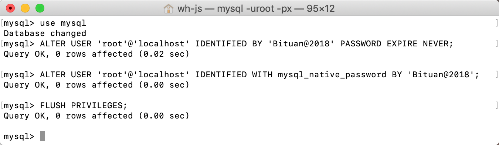

使用` Navicat `连接` mysql `时报如下错误:


报错的原因是：

```
mysql 8 之前的版本中加密规则是 mysql_native_password ,而在 mysql8 之后,加密规则是 caching_sha2_password
```

解决: 更改加密规则

```sh
mysql -uroot -ppassword #登录

use mysql; #选择数据库
# 远程连接请将'localhost'换成'%'

ALTER USER 'root'@'localhost' IDENTIFIED BY 'password' PASSWORD EXPIRE NEVER; #更改加密方式

ALTER USER 'root'@'localhost' IDENTIFIED WITH mysql_native_password BY 'password'; #更新用户密码

FLUSH PRIVILEGES; #刷新权限
```



再次连接，就可以成功了。
