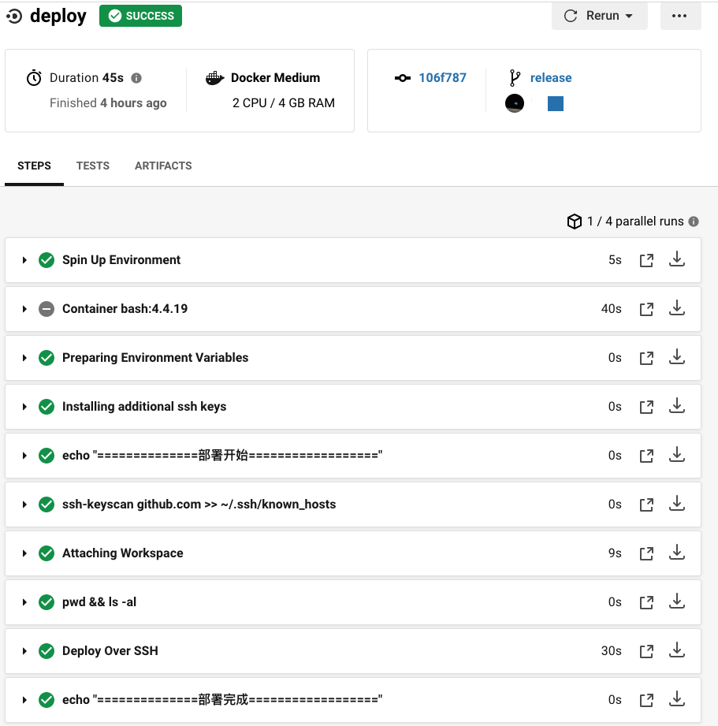
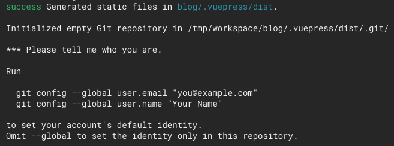

[GitHub](https://github.com/) 能托管软件项目,对个人开发者十分友好，并且它还提供了[GitHub Pages](https://pages.github.com/) 功能，让我们可以搭建我们自己的个人博客网站。

## 关联账户

既然是构建自己的博客网站，就首先有博客仓库，并且将仓库托管到GitHub上。这里是使用[VuePress](https://www.vuepress.cn/)来搭建我们的博客。

然后在[CircleCI](https://circleci.com/)上，用 ***GitHub账号*** 登录CircleCI。登录后，就可以将我们的GitHub仓库和CircleCI起来


## 添加 ssh 密钥

1. 创建密钥

通常我们都是使用 ssh-keygen -t rsa 创建公钥(.pub)和私钥，但是在CircleCI上添加密钥时会报错：


然后官网提供了[方案](https://circleci.com/docs/2.0/add-ssh-key/):

```sh
ssh-keygen -m PEM -t rsa -C "email@example.com"
```

2. 添加密钥

生成了ssh 密钥后，我们需要将密钥添加到CircleCI上，将公钥添加到GitHub上。

GitHub 添加公钥就不说了，这里只说 CircleCI 添加密钥。


> 添加密钥时，Hostname 需要填 github.com

密钥添加完后，就可以看到：


GitHub 添加完后：


可以看到 CircleCI 和GitHub 上 fingerprints 是相同的。

其中，fingerprints 我们是需要添加到构建步骤里的:

```yml
steps:
  - add_ssh_keys:
      fingerprints:
        - "80:b8:2a:XX:XX:XX:XX:XX:6c:28"
```

## 构建配置

在项目根目录下新建文件夹.circleci，然后再新建两个文件，目录就是这样：

```
|-- blog // 项目名称
  |--.circleci
      |-- config.yml
      |-- deploy.sh

```

其中，config.yml文件是配置文件，deploy.sh是部署脚本.

部署脚本在VuePress有[教程](https://www.vuepress.cn/guide/deploy.html#github-pages):

```sh
#!/usr/bin/env sh

# 终止一个错误
set -e

# 构建
npm run build

# 进入生成的构建文件夹
cd blog/.vuepress/dist

# 如果你是要部署到自定义域名
# echo 'www.example.com' > CNAME

git init
git add -A
git commit -m 'deploy'

echo "before push"
# 如果你想要部署到 https://<USERNAME>.github.io
git push -f git@github.com:<USERNAME>/<USERNAME>.github.io.git master
echo "after push"
cd -
```

然后在CircleCI里可以看到部署任务列表和部署详情：




## 遇到的问题

#### 1. The authenticity of host 'github.com' can't be established

当CircleCI服务器尝试连接到GitHub的主机时，它可能会提示验证主机密钥。提示是自动化的氪星石：CI环境将无限期挂起，等待用户给出响应。这时我们就只能取消Job：


**解决方法：**

```yml
- run: ssh-keyscan github.com >> ~/.ssh/known_hosts
```

#### 2. GitHub does not provide shell access

因为这里我们需要执行脚本，但是GitHub可能会提示没有权限。


**解决方法：**

```yml
- run:
  name: get bash permission
  command: chmod 755 ./.circleci/deploy.sh
```

#### 3. git 配置



这个简单，只需要按照提示，在部署脚本里加上Git配置就可以了。

## 最终部署脚本

- config.yml

```yml
version: 2
jobs:
  build:
    working_directory: /tmp/workspace
    docker:
      - image: circleci/node:latest
      - image: bash:4.4.19
    steps:
      - run: echo "==============构建开始=================="
      - checkout
      - run: sudo apt-get update
      - run: sudo apt-get install git
      - run:
          name: Update npm
          command: 'sudo npm install -g npm@latest'
      - restore_cache:
          key: dependency-cache-{{ checksum "package.json" }}
      - run:
          name: Install npm dep
          command: npm install
      - save_cache:
          key: dependency-cache-{{ checksum "package.json" }}
          paths:
            - node_modules
      - persist_to_workspace:
          root: .
          paths:
            - ./*
      - run: echo "==============构建完成=================="
  deploy:
    working_directory: /tmp/workspace
    docker:
      - image: circleci/node:latest
      - image: bash:4.4.19
    steps:
      - add_ssh_keys:
          fingerprints:
            - "80:b8:2a:XX:XX:XX:XX:XX:6c:28"
      - run: echo "==============部署开始=================="
      - run: ssh-keyscan github.com >> ~/.ssh/known_hosts
      - attach_workspace:
          at: /tmp/workspace
      - run: pwd && ls -al
      - run:
          name: get bash permission
          command: chmod 755 ./.circleci/deploy.sh
      - run:
          name: Deploy Over SSH
          command: ./.circleci/deploy.sh
      - run: echo "==============部署完成=================="

workflows:
  version: 2
  build_and_deploy:
    jobs:
      - build
      - deploy:
          requires:
            - build
          filters:
            branches:
              only: release
```

> 这里我使用release分支作为部署分支，因为使用VuePress时，构建后，项目的目录会不同，然后push 到 master分支后，项目就改变了。再次push 时，它会要求我们先从 master 分支上 pull最新代码，这不是我想要的结果，所以用release分支作为部署分支。

- deploy.sh

```sh
#!/usr/bin/env sh

# 终止一个错误
set -e

git config --global user.email "you@example.com"
git config --global user.name "your name"


# 构建
npm run build

# 进入生成的构建文件夹
cd blog/.vuepress/dist

# 如果你是要部署到自定义域名
# echo 'www.example.com' > CNAME

git init
git add -A
git commit -m 'deploy'

echo "before push"
# 如果你想要部署到 https://<USERNAME>.github.io
git push -f git@github.com:<USERNAME>/<USERNAME>.github.io.git master
echo "after push"
cd -
```

配置好了之后，我们每次push代码到release分支时，就会自动构建啦，打开我们的个人GitHub Pages网站时，就可以看到我们的博客网站啦。
