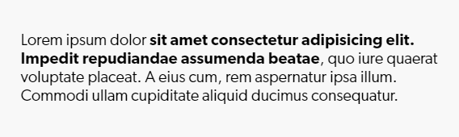
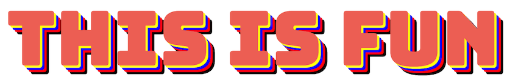
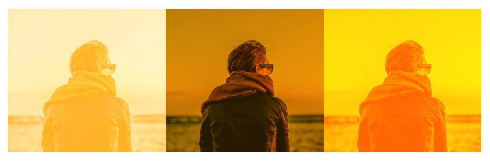
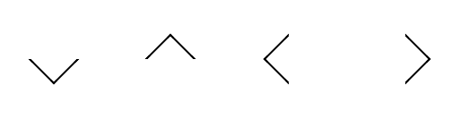

## 重写数字输入框箭头样式

```less
input[type="number"] {
  -moz-appearance: textfield;
}

//清除input上下小箭头
input::-webkit-outer-spin-button,
input::-webkit-inner-spin-button {
  -webkit-appearance: none !important;
  margin: 0;
}
```

## 移动端常用样式

```less
html {
  -webkit-font-smoothing: antialiased; // 抗锯齿渲染
  -moz-osx-font-smoothing: grayscale;

  -webkit-tab-highlight-color: transparent; // 去掉手机端点击高亮效果

  touch-action: manipulation; // 解决 iOS 等设备点击 300ms 延迟问题
  -ms-touch-action: manipulation;

  -webkit-overflow-scrolling: touch; // 解决 iOS 上滚动卡顿问题

  padding-bottom env(safe-area-inset-bottom);// 兼容 iPhone X
  padding-top env(safe-area-inset-top);

  text-size-adjust none; // 文字不会根据屏幕大小调整

  -webkit-touch-callout: none; //解决闪退

  -ms-user-select: none; // 禁用页面选择
  -moz-user-select: none;
  -webkit-user-select: none;
  user-select none;
}
```

## 渐变色文字

```html
<span class="gradient-text">GRADIENT TEXT</span>
```

```css
.gradient-text {
  font-size: 50px;
  background-image: linear-gradient(90deg, red, blue);
  background-image: -webkit-linear-gradient(0deg, red, blue);
  background-clip: text;
  -webkit-background-clip: text;
  color: transparent;
  -webkit-text-fill-color: transparent;
}
```
效果:


## 下划线动画效果

```html
<div class="content">
  <p>Lorem ipsum dolor <a class="fancy-link" href="#">sit amet consectetur adipisicing elit. Impedit repudiandae assumenda beatae</a>, quo iure quaerat voluptate placeat. A eius cum, rem aspernatur ipsa illum. Commodi ullam cupiditate aliquid ducimus consequatur.</p>
</div>
```
```css
.fancy-link {
  text-decoration: none;
  background-image: linear-gradient(red, red);
  background-repeat: no-repeat;
  background-position: bottom left;
  background-size: 0 3px;
  transition: background-size 500ms ease-in-out;
}
.fancy-link:hover {
  background-size: 100% 3px;
}
```
效果:




## text-shadow - 文字多层阴影效果
```html
<h2 class="so-many-shadows">This is fun</h2>
```
```css
.so-many-shadows {
  text-shadow:
    3px 3px 0 yellow,
    6px 6px 0 blue,
    9px 9px red,
    12px 12px 0 black;

  text-transform: uppercase;
}
```
效果:



## 背景混合

` background-blend-mode `属性定义了背景层的混合模式（图片与颜色）

```html
<div class="content">
  <div class="one"></div>
  <div class="two"></div>
  <div class="three"></div>
</div>
```
```css
.one, .two, .three {
  background-color: orange;
  background-image: url(https://picsum.photos/id/1005/600/600);
}
.one { background-blend-mode: screen; }
.two { background-blend-mode: multiply; }
.three { background-blend-mode: overlay; }
```

效果:



## 实现箭头

```html
<div>
  <span class="arrow-down"></span>
  <span class="arrow-up"></span>
  <span class="arrow-left"></span>
  <span class="arrow-right"></span>
</div>
```

```css
span {
  display: inline-block;
  width: 20px;
  height: 20px;
  position: relative;
  margin: 20px;
}
span::after {
  content: '';
  position: absolute;
  top: 0;
  left: 0;
  right: 0;
  bottom: 0;
  border: 1px solid;
  border-color: black black transparent transparent;
}

.arrow-down::after {
  transform: matrix(0.71, 0.71, -0.71, 0.71, 0, 0) rotate(90deg);
}

.arrow-up::after {
  transform: matrix(0.71, 0.71, -0.71, 0.71, 0, 0) rotate(-90deg);
}

.arrow-right::after {
  transform: matrix(0.71, 0.71, -0.71, 0.71, 0, 0) rotate(0deg);
}

.arrow-left::after {
  transform: matrix(0.71, 0.71, -0.71, 0.71, 0, 0) rotate(180deg);
}
```

