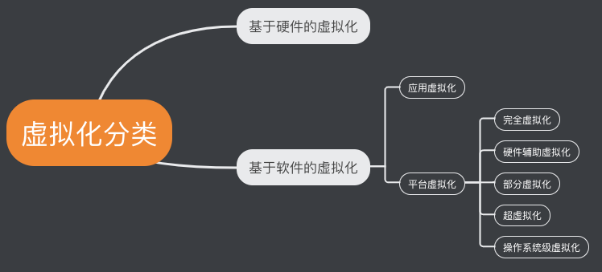

## 一、容器

### 1.1 什么是容器

` IBM DeveloperWorks `网站这样描述容器：

> 容器有效地将由单个操作系统管理的资源划分到孤立的组中，以更好地在孤立的组之间平衡有冲突的资源使用需求。与虚拟化相比，这样既不需要指令级模拟，也不需要即时编译。容器可以在核心` CPU `本地运行指令，而不需要任何专门的解释机制。此外，也避免了准虚拟化(` Paravirtualization `)和系统调用替换中的复杂性。

简单来说，**容器可以将软件打包成标准化的单元，以用于开发、交付和部署。**

容器是轻量的，包含了软件运行所需的所有内容：代码、运行时的环境、系统工具、系统库和设置。而且容器赋予了软件独立性，避免了环境差异(比如开发和生产环境)的影响，从而有助于减少团队在相同基础设施上运行不同软件的冲突。

## 二、` Docker `的基础概念

### 2.1 什么是` Docker `？

我们从下面的四点理解什么是` Docker `:

1. ` Docker `是世界领先的软件容器平台。
2. ` Docker `使用` Google `公司推出的` Go `语言  进行开发实现，基于` Linux `内核的` cgroup `，` namespace `，以及` AUFS `类的` UnionFS `等技术，对进程进行封装隔离，属于操作系统层面的虚拟化技术。 由于隔离的进程独立于宿主和其它的隔离的进
程，因此也称其为容器。
3. ` Docker `能够自动执行重复性任务，例如搭建和配置开发环境，从而解放了开发人员以便他们专注在真正重要的事情上：构建杰出的软件。
4. 用户可以方便地创建和使用容器，把自己的应用放入容器。容器还可以进行版本管理、复制、分享、修改，就像管理普通的代码一样。

### 2.2 Docker 架构

先来看下Docker架构：

1. ` Docker Host `是进行` Docker `操作的宿主机，在里面运行了一个` Docker daemon `的核心守护进程，负责构建、运行和分发` Docker `容器。

2. 在宿主机中安装了` Docker `客户端，它与` Docker daemon `守护进程进行通信，客户端会将` build `、` pull `、` run `等命令发送到` Docker daemon `守护进程执行。

3. 右边` Registry `是镜像仓库，其中存储着` Docker `镜像，是一个所有` Docker `用户共享` Docker `镜像的服务，` Docker daemon `守护进程与之进行交互。

### 2.3 ` Docker `的思想
- **集装箱**
- **标准化**： 1. 运输方式 2. 存储方式 3. ` API `接口
- **隔离**

### 2.4 ` Docker `容器的特点

- **标准化**

` Docker `使用行业标准来创建容器，所以容器能适用于所有地方。

- **轻量**

容器共享计算机的操作系统系统内核，因此不需要每个应用程序都使用操作系统，从而提高了服务器效率，并降低了服务器和许可成本。

- **安全**

Docker 赋予应用的隔离性不仅限于彼此隔离，还独立于底层的基础设施。Docker 默认提供最强的隔离，因此应用出现问题，也只是单个容器的问题，而不会波及到整台机器。

### 2.5 ` Docker `优势

1. **更快速的交付和部署**：使用` Docker `，开发人员可以使用镜像来快速构建一套标准的开发环境。开发完成之后，测试和运维人员可以直接使用完全相同的环境来部署代码。` Docker `可以快速创建和删除容器，实现快速迭代，节约开发、测试、部署的大量时间。

2. **更高效的资源利用**：运行` Docker `容器不需要额外的虚拟化管理程序(` VMM `以及` Hypervisor `)的支持，` Docker `是内核级的虚拟化，可以实现更高的性能，同时对资源的额外需求很低。

3. **更轻松的迁移和扩展**：` Docker `容器几乎可以在任意的平台上运行，这种兼容性让用户可以在不同平台之间轻松地迁移应用。

4. **更简单的更新管理**：使用` Dockerfile `，只需要小小的配置修改后，所以得修改都以增量的方式被分发和更新，从而实现自动化和高效的容器管理。

### 2.6 ` Docker `的核心概念

` Docker `包含三个核心概念

1. 镜像(` Image `)
2. 容器(` Container `)
3. 仓库(` Repository `)

#### 镜像(` Image `)

> 一个特殊的文件系统

操作系统分为内核和用户空间。对于` Linux `而言，内核启动后，会挂载` root `文件系统为其提供用户空间支持。而` Docker `镜像(` Image `)就相当于是一个` root `文件系统。

` Docker `镜像是一个特殊的文件系统，除了提供容器运行时所需的程序、库、资源、配置等文件外，还包含了一些运行时所需的一些配置参数(如匿名卷、环境变量和用户等)。镜像不包含任何动态数据，其内容在构建之后也不会被改变。

` Docker `充分利用` Union FS `技术，**将容器设计为分层存储的架构**。

***镜像实际是由多层文件系统联合组成。镜像构建时，会一层层构建，前一层是后一层的基础。每一层构建完成后不会再发生改变，后一层上的任何改变只发生在自己这一层***。比如，删除前一层文件的操作，实际不是真的删除前一层的文件，而是仅在当前层标记该文件已删除。在最终容器运行时，虽然不会看到这个文件，但实际上该文件会一直跟随镜像。因此，在构建镜像时，需要小心，每一层尽量只包含该层需要添加的东西，任何额外的东西应该在该层构建结束前清理掉。

分层存储的架构还使得镜像的复用、定制变得更为容易。甚至可以用之前构建好的镜像作为基础层，然后进一步添加新的层，以定制自己所需的内容，构建新的镜像。

#### 容器(` Container `)

> 镜像运行时的实体

镜像和容器的关系，就像是面向对象程序设计中的 类 和 实例 一样，**镜像是静态的定义，容器是镜像运行时的实体。**

容器的实质是进程，但与直接在宿主环境执行的进行不同，容器进程运行于属于自己的独立的命名空间。容器也是使用分层存储。

容器存储层的生命周期和容器一样，容器消亡时，容器存储层也随之消亡。因此，任何保存于容器存储层的信息都会随容器的消亡而丢失。

所以，不应该将数据存储在容器中，容器存储层要保持无状态化。所有的文件写入操作，都应该使用数据卷(` Volume `)、或者绑定宿主目录，在这些位置的读写会跳过容器存储层，直接对宿主（或网路存储）发生读写，其性能和稳定性更高。数据卷的生命周期独立于容器，容器消亡，数据卷不会消亡。因此，使用数据卷后，容器可以随意删除、重新运行，数据不会丢失。

#### 仓库(` Repository `)

> 集中存放镜像文件的地方

一个` Docker Registry `中可以包含多个仓库（` Repository `）；每个仓库可以包含多个标签（` Tag `）；每个标签对应一个镜像。

最常使用的` Registry `公开服务是官方的[ Docker Hub ](https://hub.docker.com/)，这也是默认的` Registry `，并拥有大量的高质量的官方镜像。在国内访问` Docker Hub `可能会比较慢，国内也有一些云服务商提供类似于` Docker Hub `的公开服务。比如[ 时速云镜像库](https://hub.tenxcloud.com/)、[网易云镜像服务](https://www.163yun.com/product/repo)、[DaoCloud 镜像市场](https://www.daocloud.io/)、[阿里云镜像库](https://www.aliyun.com/product/containerservice?utm_content=se_1292836)等。

### 三、` Docker `和 虚拟机
### 3.1 虚拟化

#### 虚拟化定义

维基百科上对虚拟化的定义如下：

> 在计算机技术中，虚拟化是一种资源管理技术，是将计算机的各种实体资源，如服务器、网络、内存及存储等，予以抽象、转换后呈现出来，打破实体结构间的不可切割的障碍，使用户可以用比原本的组态更好的方式来应用这些资源。

简单来说，**虚拟化的核心是对资源的抽象**，目标往往是为了在同一个主机上同时运行多个系统或应用，从而提高系统资源的利用率，并且带来降低成本、方便管理和容错容灾等好处。

#### 虚拟化分类

` Docker `以及其他容器技术都属于操作系统虚拟化这个范畴，操作系统虚拟化最大的特点就是不需要额外的` supervisor `支持。

### 3.2 ` Docker `和其他虚拟机的不同点

传统方式是在硬件层面实现虚拟化，需要有额外的虚拟机管理应用和虚拟机操作系统层。` Docker `容器是在操作系统层面上实现虚拟化，直接复用本地主机的操作系统，因此更加轻量级。

### 3.3 ` Docker `与虚拟机比较

特性  | 容器  | 虚拟机
--    | --   | --
启动速度  | 秒级              | 分钟级
性能     | 接近原生           | 较弱
内存代价  | 很小              | 较多
硬盘使用  | 一般为MB          | 一般为GB
运行密度  | 单机支持上千个容器  | 一般十几个
隔离性    | 安全隔离          | 安全隔离
迁移性    | 优秀             | 一般

## 参考文献

Docker技术入门与实战(第3版)

[Docker 搭建你的第一个 Node 项目到服务器(完整版)](https://juejin.im/post/6844904035053486087)

[可能是把Docker的概念讲的最清楚的一篇文章](https://juejin.im/post/6844903625584558093#heading-16)
