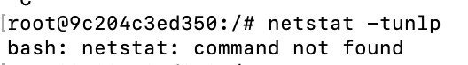
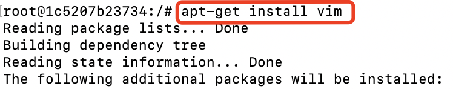

很多时候，系统管理员都习惯通过 SSH 服务来远程登录管理服务器，但是 Docker 的很多镜像都不带 SSH 服务的，所以需要我们自己自定义镜像来添加 SSH 服务，可以通过下面的方法添加 SSH 服务：

- 基于 commit 命令创建
- 基于 Dockerfile 创建

## 一、基于 commit 命令创建

Docker 提供了 commit 命令，支持用户提交自己对容器的修改，并生成新的镜像。命令格式为：

> docker commit CONTAINER [REPOSITORY[:TAG]]

### 1. 创建 Ubuntu 容器

首先，获取 ubuntu:18.04镜像，然后创建一个容器，并在其中运行 bash 应用：

```sh
docker pull ubuntu:18.04
docker run -it ubuntu:18.04 bash
```

### 2. 检查软件源

第二步，检查软件源，并使用 apt-get update 命令来更新软件源信息：

```sh
apt-get update
```
执行这个命令还是十分有必要的

如果没有执行这个命令，后面 install 一些工具时，可能会报错，说找不到 package：


这都是因为没有执行 apt-get update命令，执行后就可以 install 了

### 3. 安装和配置 SSH 服务

第三步，安装和配置 SSH 服务。

选择 openssh-server 作为服务端：

```sh
apt-get install openssh-server
```

如果需要正常启动 SSH 服务，目录 /var/run/sshd 必须存在，这里需要手动创建它，并启动 SSH 服务：

```sh
mkdir -p /var/run/sshd
/usr/sbin/sshd -D &
```

此时，用下面的命令查看容器的22端口(SSH服务默认监听的端口)，可以发现22端口已经处于监听状态。

```sh
netstat -tunlp | grep 22
```

结果如图：


这时可能会报错：



这是由于网络工具没有安装，执行下面的命令就可以了：

```sh
apt-get install net-tools
```


修改 SSH 服务的安全登录配置，取消 pam 登录限制：

```sh
sed -ri 's/session required pam_loginuid.so/#session required pam_loginuid.so/g' /etc/pam.d/sshd
```

在 root 用户目录下创建 .ssh 目录，并复制需要登录的公钥信息(一般为本地主机用户目录下的` .ssh/id_rsa.pub `文件)到authorized_keys文件中：

```sh
mkdir root/.ssh
vi /root/.ssh/authorized_keys
```

这里同样可能会报错，说vi: command not found，执行install 命令就可以了：



创建自动启动 SSH 服务的可执行文件 run.sh，并添加可执行权限：

```sh
vi /run.sh
chmod +x run.sh
```

run.sh 脚本内容如下：

```sh
#!/bin/bash
/usr/sbin/sshd -D
```

最后，输入exit，退出容器


### 4. 保存镜像

首先，使用 docker ps -a 命令查看容器：


这里可以看到**容器的ID**

然后用 docker commit 命令将容器保存为一个新的 sshd:ubuntu 镜像

```sh
docker commit 36f9aa524dd4 sshd:ubuntu
```

创建成功后，我们可以用 docker images 命令查看一下镜像:


### 5. 使用镜像

启动容器，并添加端口映射 10022 -> 22，其中 10022 是宿主主机的端口，22是容器的 SSH 服务监听的端口：

```sh
docker run -p 10022:22 -d sshd:ubuntu /run.sh
```

确保宿主主机对外端口10022对外防火墙已经打开

最后，在宿主主机(192.168.1.200)或其他主机上，通过 SSH 访问端口来登录容器：

```sh
ssh 192.168.1.200 -p 10022
```
