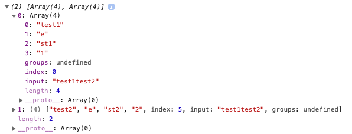

### ` ES7（2016）`

#### - ` Array.prototype.includes() `

```js
[1].includes(1); // true
```

#### - 指数操作符

```js
2**10; // 1024
```

### ` ES8（2017） `

#### - ` async/await `

异步解决方案

#### - ` Object.values() `

```js
Object.values({a: 1, b: 2, c: 3}); // [1,2,3]
```

#### - ` Object.entries() `

```js
Object.entries({a: 1, b: 2, c: 3}); // [['a', 1], ['b', 2], ['c', 3]]
```

#### - ` String padding `

1. ` String.prototype.padStart(max, fillString) `

```js
'abc'.padStart(6); // '   abc'

'abc'.padStart(6, 'xo'); // 'xoxabc'
```

2. ` String.prototype.padEnd(max, fillString) `

```js
'abc'.padEnd(6); // 'abc   '

'abc'.padEnd(6, '123456'); // 'abc123'
```


### ` ES9（2018） `

#### - 异步迭代

` await `可以和` for...of `循环一起使用，以串行的方式运行异步操作

```js
async function process(array) {
  for await (let i of array) {
    // doSomething(i);
  }
}
```

#### - ` Rest/Spread `属性

```js
const values = [1, 2, 3, 4, 5, 6];
console.log(Math.max(...values)); // 6
```

#### - 正则表达式命名捕获组

```js
const reg = /(?<year>[0-9]{4})-(?<mothon>[0-9]{2})-(?<day>[0-9]{2})/;
const match = reg.exec('2021-04-22')
```


#### - 正则表达式反向断言

1. ` x(?=y) `、` (?<=y)x`: 查找` y `前面(后面)的` x `
2. `x(?!y)`、`(?<!y)x`: 查找 后面(前面) 不是` y `的` x `

#### - 正则表达式` dotAll `模式

> 正则表达式中 点(` . `) 匹配除 换行符(` \n `) 外的任何单字符，加上` s `修饰符后改变这种行为，允许换行符(` \n `) 的出现。

```js
/hello.world/.test('hello/nworld'); // false
/hello.world/s.test('hello/nworld'); // true
```

### ` ES10（2019） `

#### - 数组实例的` flat() `和` flatMap() `

```js
[1, 2, [3, 4]].flat(Infinity); // [1, 2, 3, 4]
[1, 2, 3, 4].flatMap(a => [a**2]); // [1, 4, 9, 16]
```

#### - ` String.prototype.matchAll() `

> ` matchAll() `方法返回一个包含所有匹配正则表达式的结果及分组捕获组的迭代器。

```js
const array = [...'test1test2'.matchAll(/t(e)(st(\d?))/g)];

console.log(array[0]); // ['test1', 'e', 'st1', '1'];
console.log(array[1]); // ['test2', 'e', 'st2', '2'];
```


#### - ` Symbol.prototype.description `

> 只读属性，返回` Symbol `对象的可选描述的字符串

```js
Symbol('description').description; // 'description'
```

### ` ES11（2020） `

#### - 空值合并运算符(` ?? `)

> 空值合并运算符(` ?? `): 当左侧的操作数为` null `或` undefined `时，返回其右侧操作数，否则返回左侧操作数


```js
console.log(0 ?? 'a'); // 0
console.log(false ?? 'a'); // false
console.log('' ?? 'a'); // ''
console.log(null ?? 'a'); // 'a'
console.log(undefined ?? 'a'); // 'a'
```

#### - 可选链操作符(` ?. `)

> 可选链操作符(` ?. `)允许读取对象链深处的属性的值。在引用为空(` null 或者 undefined `)的情况下不会引起错误。

```js
let user = {};
let u1 = user.children.name; // TypeError: Cannot read property 'name' of undefined;
let u1 = user.children?.name; // undefined
```

#### - ` Promise.allSettled() `

> ` Promise.allSettled() `方法返回一个在所有给定的` promise `都已经` fulfilled `或` rejected `后的` promise `，并带一个对象数组，每个对象表示对应的` promise `结果。
>
> 当有多个彼此不依赖的异步任务成功完成时，或者总是想知道每个` promise `的结果时，通常使用它。

```js
const promise1 = Promise.resolve(3);
const promise2 = new Promise((resolve, reject) => setTimeout(reject, 100, 'foo'));
const promises = [promise1, promise2];

Promise.allSettled(promises).
  then((results) => results.forEach((result) => console.log(result.status)));
// "fulfilled"
// "rejected"

```

####  - ` BigInt `

> ` BigInt `可以表示任意大的整数。

#### - ` globalThis `

- 浏览器: ` window `
- ` worker `: ` self `
- ` node `: ` global `


### ` ES12（2021） `

#### - ` Promise.any() `

> ` Promise.any() `接收一个` Promise `可迭代对象，只要其中的一个` promise `成功，就返回那个已经成功的` promise `。如果可迭代对象中没有一个` promise `成功（即所有的` promises `都失败/拒绝），就返回一个失败的` promise `。

> ` Promise.any() `方法依然是实验性的，它当前处于 [` TC39 `第四阶段草案（` Stage 4 `）](https://github.com/tc39/proposal-promise-any)

```js
const pErr = new Promise((resolve, reject) => {
  reject("总是失败");
});

const pSlow = new Promise((resolve, reject) => {
  setTimeout(resolve, 500, "最终完成");
});

const pFast = new Promise((resolve, reject) => {
  setTimeout(resolve, 100, "很快完成");
});

Promise.any([pErr, pSlow, pFast]).then((value) => {
  console.log(value);
})
// 输出: "很快完成"
```

#### - ` String.prototype.replaceAll() `

> ` replaceAll() `方法返回一个新字符串，新字符串所有满足` pattern `的部分都已被` replacement `替换。` pattern `可以是一个字符串或一个` RegExp `， ` replacement `可以是一个字符串或一个在每次匹配被调用的函数。

```js
const p = 'The quick brown fox jumps over the lazy dog. If the dog reacted, was it really lazy?';

console.log(p.replaceAll('dog', 'monkey'));
// expected output: "The quick brown fox jumps over the lazy monkey. If the monkey reacted, was it really lazy?"


// global flag required when calling replaceAll with regex
const regex = /Dog/ig;
console.log(p.replaceAll(regex, 'ferret'));
// expected output: "The quick brown fox jumps over the lazy ferret. If the ferret reacted, was it really lazy?"
```

#### - ` WeakRefs `

> 使用` WeakRefs `的` Class `类创建对对象的弱引用(对对象的弱引用是指当该对象应该被` GC `回收时不会阻止` GC `的回收行为)

#### - `??=`、`&&=`、 `||=`

1. 逻辑空赋值(` ??= `)

> 逻辑空赋值(` x ??= y `)仅在` x `是[` nullish `](https://developer.mozilla.org/zh-CN/docs/Glossary/Nullish) (` null `或` undefined `) 时对其赋值

```js
const a = {duration: 50};

a.duration ??= 10;
console.log(a.duration); // 50;

a.speed ??= 25;
console.log(a.duration); // 25;
```

2. 逻辑与赋值(` &&= `)

> 逻辑与赋值(` x &&= y `)仅在` x `是 [` truthy `](https://developer.mozilla.org/zh-CN/docs/Glossary/Truthy) 时对其赋值

```js
let a = 1; // a is truthy
let b = 0; // b is Falsy

a &&= 2;
console.log(a); // 2

b &&= 2;
console.log(b); // 0
```

3. 逻辑或赋值(` ||= `)

> 逻辑或赋值(` x ||= y `)仅在` x `是 [` Falsy `](https://developer.mozilla.org/zh-CN/docs/Glossary/Falsy) 时对其赋值

```js
const a = { duration: 50, title: '' };

a.duration ||= 10;
console.log(a.duration); // 50

a.title ||= 'title is empty.';
console.log(a.title); //  "title is empty"
```

#### - 数字分隔符

> 通过 下划线(` _ `) 来分割数字，使数字更具可读性

```js
const money = 1_000_000_000;
//等价于
const money = 1000000000;

1_000_000_000 === 1000000000; // true
```
