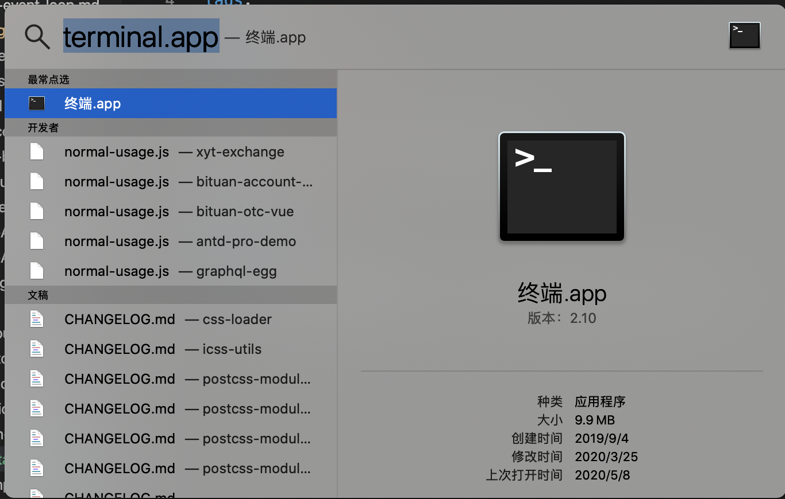
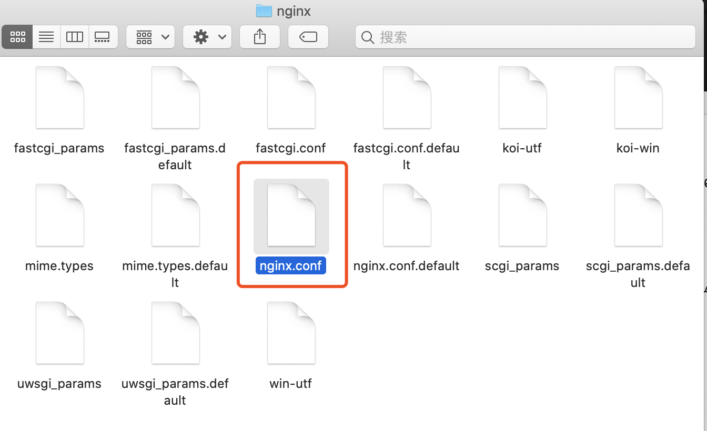

安装工具：[honebrew](https://brew.sh)

安装方式： 命令行

## 步骤

1. 打开终端：快捷键Command + Space，然后输入 terminal.app



2. 输入命令

```sh
brew update
```

3. 查询 nginx 软件是否存在

```sh
brew search nginx
```

4. 安装

```sh
brew install nginx
```

5. 查看nginx的信息

```sh
brew info nginx
```


在这里，我们可以看到nginx 的Docroot(/usr/local/var/www)，配置文件是/usr/local/etc/nginx/nginx.conf
并且默认端口是8080，运行时不需要加sudo，然后也说明了运行命令。

6. 查看nginx目录

```sh
open /usr/local/etc/nginx
```



打开了nginx目录，然后我们就可以看到nginx.conf配置文件

7. 查看nginx.conf文件

```sh
cat /usr/local/etc/nginx/nginx.conf
```

8. 查看nginx被安装到了哪里

```sh
open /usr/local/Cellar/nginx
```
