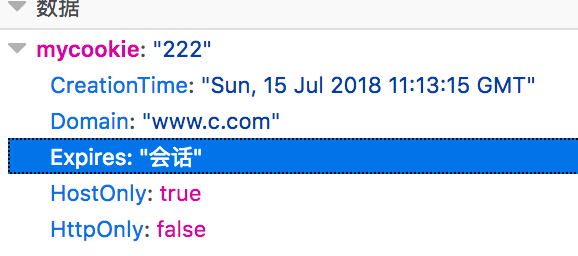
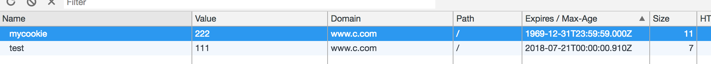

` CSRF `（` Cross Site Request Forgery `, 跨站域请求伪造）是一种劫持受信任用户向服务器发送非预期请求的攻击方式。

通常情况下，` CSRF `攻击是攻击者借助受害者的` Cookie ` 骗取服务器的信任，可以在受害者毫不知情的情况下以受害者名义伪造请求发送给受攻击服务器，从而在并未授权的情况下执行在权限保护之下的操作。

### ` CSRF `攻击的对象

` CSRF `攻击是黑客借助受害者的` cookie ` 骗取服务器的信任，但是黑客并不能拿到` cookie `，也看不到` cookie ` 的内容。另外，对于服务器返回的结果，由于浏览器同源策略的限制，黑客也无法进行解析。因此，黑客无法从返回的结果中得到任何东西，他所能做的就是给服务器发送请求，以执行请求中所描述的命令，在服务器端直接改变数据的值，而非窃取服务器中的数据。所以，我们要保护的对象是那些可以直接产生数据改变的服务，而对于读取数据的服务，则不需要进行 ` CSRF `的保护。比如银行系统中转账的请求会直接改变账户的金额，会遭到` CSRF ` 攻击，需要保护。而查询余额是对金额的读取操作，不会改变数据，` CSRF `攻击无法解析服务器返回的结果，无需保护。

### 浏览器的` Cookie `策略

` Cookie `是服务器发送到用户浏览器并保存在本地的一小块数据，它会在浏览器下次向同一服务器再发起请求时被携带并发送到服务器上。` Cookie `主要用于以下三个方面：

- 会话状态管理（如用户登录状态、购物车、游戏分数或其它需要记录的信息）
- 个性化设置（如用户自定义设置、主题等）

而浏览器所持有的` Cookie `分为两种：

- ` Session Cookie `(会话期` Cookie `)：会话期` Cookie  `是最简单的` Cookie `，它不需要指定过期时间（` Expires `）或者有效期（` Max-Age `），它仅在会话期内有效，浏览器关闭之后它会被自动删除。
- ` Permanent Cookie `(持久性` Cookie `)：与会话期 ` Cookie `不同的是，持久性` Cookie ` 可以指定一个特定的过期时间（` Expires `）或有效期（` Max-Age `）。

```js
res.setHeader('Set-Cookie', ['mycookie=222', 'test=3333; expires=Sat, 21 Jul 2018 00:00:00 GMT;']);
```

上述代码创建了两个` Cookie：mycookie `和  ` test `，前者属于会话期` Cookie `，后者则属于持久性 ` Cookie `。当我们去查看` Cookie ` 相关的属性时，不同的浏览器对会话期` Cookie `的` Expires `属性值会不一样：

` Firefox `：



` Chrome `:



此外，每个` Cookie ` 都会有与之关联的域，这个域的范围一般通过` donmain ` 属性指定。如果` Cookie ` 的域和页面的域相同，那么我们称这个` Cookie `为第一方 ` Cookie `（` first-party cookie `），如果` Cookie ` 的域和页面的域不同，则称之为第三方` Cookie `（` third-party cookie `）。一个页面包含图片或存放在其他域上的资源（如图片）时，第一方的` Cookie `也只会发送给设置它们的服务器。

### ` CSRF `攻击的防范

当前，对` CSRF `攻击的防范措施主要有如下几种方式。

#### 验证码

验证码被认为是对抗` CSRF `攻击最简洁而有效的防御方法。

` CSRF `攻击往往是在用户不知情的情况下构造了网络请求。而验证码会强制用户必须与应用进行交互，才能完成最终请求。因为通常情况下，验证码能够很好地遏制` CSRF `攻击。

但验证码并不是万能的，因为出于用户考虑，不能给网站所有的操作都加上验证码。因此，验证码只能作为防御` CSRF  `的一种辅助手段，而不能作为最主要的解决方案。

#### ` Referer Check `

根据` HTTP `协议，在` HTTP `头中有一个字段叫 ` Referer `，它记录了该` HTTP `请求的来源地址。通过` Referer Check `，可以检查请求是否来自合法的"源"。

比如，如果用户要删除自己的帖子，那么先要登录 ` www.c.com `，然后找到对应的页面，发起删除帖子的请求。此时，` Referer `的值是` http://www.c.com `；当请求是从 ` www.a.com `发起时，` Referer `的值是` http://www.a.com  `了。因此，要防御` CSRF ` 攻击，只需要对于每一个删帖请求验证其` Referer ` 值，如果是以` www.c.com ` 开头的域名，则说明该请求是来自网站自己的请求，是合法的。如果` Referer `是其他网站的话，则有可能是` CSRF   `攻击，可以拒绝该请求。

针对上文的例子，可以在服务端增加如下代码：

```js
if (req.headers.referer !== 'http://www.c.com:8002/') {
    res.write('csrf 攻击');
    return;
}
```

` Referer Check `不仅能防范` CSRF ` 攻击，另一个应用场景是 "防止图片盗链"。

#### 添加` token `验证

` CSRF `攻击之所以能够成功，是因为攻击者可以完全伪造用户的请求，该请求中所有的用户验证信息都是存在于` Cookie `中，因此攻击者可以在不知道这些验证信息的情况下直接利用用户自己的` Cookie `来通过安全验证。要抵御 ` CSRF `，关键在于在请求中放入攻击者所不能伪造的信息，并且该信息不存在于` Cookie `之中。可以在` HTTP ` 请求中以参数的形式加入一个随机产生的 ` token `，并在服务器端建立一个拦截器来验证这个 ` token `，如果请求中没有` token `或者` token ` 内容不正确，则认为可能是` CSRF `攻击而拒绝该请求。

这种方法要比检查` Referer `要安全一些，` token ` 可以在用户登陆后产生并放于` session ` 之中，然后在每次请求时把` token `从` session ` 中拿出，与请求中的` token ` 进行比对，但这种方法的难点在于如何把` token ` 以参数的形式加入请求。对于` GET `请求，` token ` 将附在请求地址之后，这样` URL `就变成 ` http://url?csrftoken=tokenvalue `。 而对于` POST ` 请求来说，要在` form `的最后加上` <input type=”hidden” name=”csrftoken” value=”tokenvalue”/> `，这样就把` token `以参数的形式加入请求了。但是，在一个网站中，可以接受请求的地方非常多，要对于每一个请求都加上` token ` 是很麻烦的，并且很容易漏掉，通常使用的方法就是在每次页面加载时，使用` javascript `遍历整个` dom `树，对于` dom `中所有的` a `和` form `标签后加入 ` token `。这样可以解决大部分的请求，但是对于在页面加载之后动态生成的` html `代码，这种方法就没有作用，还需要程序员在编码时手动添加` token `。

该方法还有一个缺点是难以保证` token ` 本身的安全。特别是在一些论坛之类支持用户自己发表内容的网站，黑客可以在上面发布自己个人网站的地址。由于系统也会在这个地址后面加上 ` token `，黑客可以在自己的网站上得到这个 ` token `，并马上就可以发动` CSRF ` 攻击。为了避免这一点，系统可以在添加` token ` 的时候增加一个判断，如果这个链接是链到自己本站的，就在后面添加` token `，如果是通向外网则不加。不过，即使这个 ` csrftoken `不以参数的形式附加在请求之中，黑客的网站也同样可以通过` Referer `来得到这个` token `值以发动` CSRF `攻击。这也是一些用户喜欢手动关闭浏览器` Referer ` 功能的原因。

### Java代码示例

1. 对请求的` Referer `验证代码如下

```java
// 从 HTTP 头中取得 Referer 值
String referer = request.getHeader("Referer");
// 判断 Referer 是否以 bank.example 开头
if((referer!=null)&&(referer.trim().startWith("bank.example"))) {
    chain.doFilter(request, response);
}else{
    request.getRequestDispatcher("error.jsp").forward(request,response);
}
```

2. 如果要进一步验证请求中的` token `值，代码如下

```java
HttpServletRequest req = (HttpServletRequest)request;
HttpSession s = req.getSession();

// 从 session 中得到 csrftoken 属性
String sToken = (String)s.getAttribute(“csrftoken”);
if(sToken == null){

   // 产生新的 token 放入 session 中
   sToken = generateToken();
   s.setAttribute(“csrftoken”,sToken);
   chain.doFilter(request, response);
} else{

   // 从 HTTP 头中取得 csrftoken
   String xhrToken = req.getHeader(“csrftoken”);

   // 从请求参数中取得 csrftoken
   String pToken = req.getParameter(“csrftoken”);
   if(sToken != null && xhrToken != null && sToken.equals(xhrToken)){
       chain.doFilter(request, response);
   }else if(sToken != null && pToken != null && sToken.equals(pToken)){
       chain.doFilter(request, response);
   }else{
       request.getRequestDispatcher(“error.jsp”).forward(request,response);
   }
}
```

首先判断` session `中有没有 ` csrftoken `，如果没有，则认为是第一次访问，` session ` 是新建立的，这时生成一个新的` token `，放于` session ` 之中，并继续执行请求。如果` session `中已经有 ` csrftoken `，则说明用户已经与服务器之间建立了一个活跃的 ` session `，这时要看这个请求中有没有同时附带这个 ` token `，由于请求可能来自于常规的访问或是 ` XMLHttpRequest `异步访问，我们分别尝试从请求中获取 csrftoken 参数以及从` HTTP `头中获取` csrftoken ` 自定义属性并与` session ` 中的值进行比较，只要有一个地方带有有效 ` token `，就判定请求合法，可以继续执行，否则就转到错误页面。生成` token `有很多种方法，任何的随机算法都可以使用，` Java `的` UUID `类也是一个不错的选择。

除了在服务器端利用` filter `来验证` token ` 的值以外，我们还需要在客户端给每个请求附加上这个 ` token `，这是利用` js `来给` html ` 中的链接和表单请求地址附加` csrftoken `代码，其中已定义 ` token `为全局变量，其值可以从` session `中得到。

3. 在客户端对于请求附加` token `

```java
function appendToken(){
   updateForms();
   updateTags();
}

function updateForms() {
   // 得到页面中所有的 form 元素
   var forms = document.getElementsByTagName('form');
   for(i=0; i<forms.length; i++) {
       var url = forms[i].action;

       // 如果这个 form 的 action 值为空，则不附加 csrftoken
       if(url == null || url == "" ) continue;

       // 动态生成 input 元素，加入到 form 之后
       var e = document.createElement("input");
       e.name = "csrftoken";
       e.value = token;
       e.type="hidden";
       forms[i].appendChild(e);
   }
}

function updateTags() {
   var all = document.getElementsByTagName('a');
   var len = all.length;

   // 遍历所有 a 元素
   for(var i=0; i<len; i++) {
       var e = all[i];
       updateTag(e, 'href', token);
   }
}

function updateTag(element, attr, token) {
   var location = element.getAttribute(attr);
   if(location != null && location != '' '' ) {
       var fragmentIndex = location.indexOf('#');
       var fragment = null;
       if(fragmentIndex != -1){

           //url 中含有只相当页的锚标记
           fragment = location.substring(fragmentIndex);
           location = location.substring(0,fragmentIndex);
       }

       var index = location.indexOf('?');

       if(index != -1) {
           //url 中已含有其他参数
           location = location + '&csrftoken=' + token;
       } else {
           //url 中没有其他参数
           location = location + '?csrftoken=' + token;
       }
       if(fragment != null){
           location += fragment;
       }

       element.setAttribute(attr, location);
   }
}
```

### 参考文献

[浅说` XSS `和` CSRF `](https://github.com/dwqs/blog/issues/68) GitHub 博客

[` CSRF `攻击的应对之道](https://www.ibm.com/developerworks/cn/web/1102_niugang_csrf/index.html)
