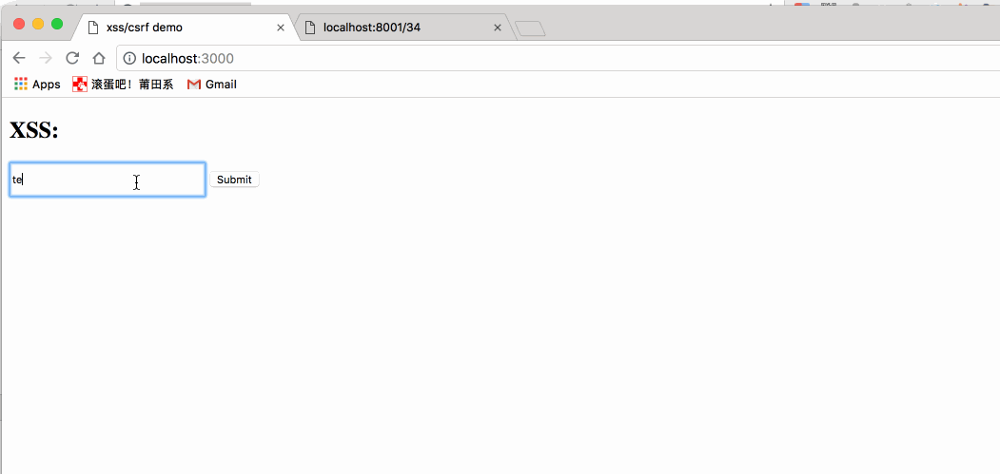

## ` XSS `简介

` XSS `（` Cross Site Script `），全称跨站脚本攻击，为了与` CSS `（` Cascading Style Sheet `） 有所区别，所以在安全领域称为` XSS `。

` XSS `攻击是指攻击者在网站上注入恶意的客户端代码，通过恶意脚本对客户端网页进行篡改，从而在用户浏览网页时，对用户浏览器进行控制或者获取用户隐私数据的一种攻击方式。

` XSS `攻击是在用户的浏览器上执行，形成过程则是服务端页面渲染时，注入了恶意的` HTML `代码导致。

攻击者对客户端网页注入的恶意脚本一般包括` JavaScript `，有时也会包含` HTML `和 `Flash `。有很多种方式进行` XSS` 攻击，但它们的共同点为：将一些隐私数据像` cookie `、` session ` 发送给攻击者，将受害者重定向到一个由攻击者控制的网站，在受害者的机器上进行一些恶意操作。

### 举个栗子

```html
<!DOCTYPE html>
<html lang="en">

<head>
  <meta charset="UTF-8">
  <meta name="viewport" content="width=device-width, initial-scale=1.0">
  <meta http-equiv="X-UA-Compatible" content="ie=edge">
  <title>XSS</title>
</head>

<body>
  <div id="t"></div>
  <input id="s" type="button" value="获取数据" onclick="test()">
</body>
<script>
  function test() {
    // 假设从后台取出的数据如下
    const arr = ['1', '2', '3', '']
    const t = document.querySelector('#t')
    arr.forEach(item => {
      const p = document.createElement('p')
      p.innerHTML = item
      t.append(p)
    })
  }
</script>

</html>
```

这个时候我们在页面上点击 获取数据 按钮时，页面上会出现如下信息：


## ` XSS `类型

` XSS `攻击可以分为3类：反射型（非持久型）、存储型（持久型）、基于` DOM `。

### 反射型

简单来说，反射型` XSS ` 只是将用户输入的数据展现到浏览器上（从哪里来到哪里去），即需要一个发起人（用户）来触发黑客布下的一个陷阱（例如一个链接，一个按钮等），才能攻击成功，一般容易出现在搜索页面、留言板块。这种反射型` XSS `也叫做 非持久型 ` XSS `（ `No-persistent XSS `） 。

例如：

```html
<!DOCTYPE html>
<html lang="en">

<head>
  <meta charset="UTF-8">
  <meta name="viewport" content="width=device-width, initial-scale=1.0">
  <meta http-equiv="X-UA-Compatible" content="ie=edge">
  <title>Document</title>
</head>

<body>
  <div id="t"></div>
  <input id="s" type="button" value="获取数据" onclick="test()">
</body>
<script>
  function test() {
    const arr = ['1', '2', '3', '']
    const t = document.querySelector('#t')
    arr.forEach(item => {
      const p = document.createElement('p')
      p.innerHTML = item
      t.append(p)
    })
  }
</script>

</html>
```

假设这是一个留言板块，加载到这一页时，页面会输出：


黑客可以轻易盗取存储在你本地浏览器的各种信息，进而模拟登陆信息，黑入账户，进行各种操作。

### 存储型

存储型` XSS `会把用户输入的数据 保存 在服务器端，这种` XSS ` 十分稳定，十分有效，效果持久。存储型` XSS `通常叫做 "持久型` XSS`（` Persistent XSS `）"，即存在时间比较长。

比较常见的场景就是，黑客写下一篇包含恶意代码的文章，文章发表后，所有访问该博客文章的用户都会执行这一段代码，进行恶意攻击。

#### 举个栗子

先准备一个输入页面：

```html
<input type="text" id="input">
<button id="btn">Submit</button>

<script>
    const input = document.getElementById('input');
    const btn = document.getElementById('btn');

    let val;

    input.addEventListener('change', (e) => {
        val = e.target.value;
    }, false);

    btn.addEventListener('click', (e) => {
        fetch('http://localhost:8001/save', {
            method: 'POST',
            body: val
        });
    }, false);
</script>
```
启动一个` Node `服务监听` save `请求。为了简化，用一个变量来保存用户的输入：

```js
const http = require('http');

let userInput = '';

function handleReequest(req, res) {
    const method = req.method;
    res.setHeader('Access-Control-Allow-Origin', '*');
    res.setHeader('Access-Control-Allow-Headers', 'Content-Type')

    if (method === 'POST' && req.url === '/save') {
        let body = '';
        req.on('data', chunk => {
            body += chunk;
        });

        req.on('end', () => {
            if (body) {
                userInput = body;
            }
            res.end();
        });
    } else {
        res.writeHead(200, {'Content-Type': 'text/html; charset=UTF-8'});
        res.write(userInput);
        res.end();
    }
}

const server = new http.Server();
server.listen(8001, '127.0.0.1');

server.on('request', handleReequest);
```
当用户点击提交按钮将输入信息提交到服务端时，服务端通过` userInput ` 变量保存了输入内容。当用户通过` http://localhost:8001/${id} ` 访问时，服务端会返回与` id ` 对应的内容(本示例简化了处理)。如果用户输入了恶意脚本内容，则其他用户访问该内容时，恶意脚本就会在浏览器端执行：



### 基于` DOM `

基于` DOM `的` XSS `攻击是指通过恶意脚本修改页面的` DOM ` 结构，是纯粹发生在客户端的攻击。

看如下代码：

```html
<h2>XSS: </h2>
<input type="text" id="input">
<button id="btn">Submit</button>
<div id="div"></div>
<script>
    const input = document.getElementById('input');
    const btn = document.getElementById('btn');
    const div = document.getElementById('div');

    let val;

    input.addEventListener('change', (e) => {
        val = e.target.value;
    }, false);

    btn.addEventListener('click', () => {
        div.innerHTML = `<a href=${val}>testLink</a>`
    }, false);
</script>
```
点击` Submit `按钮后，会在当前页面插入一个链接，其地址为用户的输入内容。如果用户在输入时构造了如下内容：

```js
'' onclick=alert(/xss/)
```
用户提交之后，页面代码就变成了：

```html
<a href onlick="alert(/xss/)">testLink</a>
```

此时，用户点击生成的链接，就会执行对应的脚本：


## 参考文献

[` Web `安全系列（一）：` XSS ` 攻击基础及原理](https://yq.aliyun.com/articles/638829?spm=a2c4e.11155435.0.0.59893312yiELAF) 阿里云云栖社区

[浅说` XSS `和` CSRF `](https://github.com/dwqs/blog/issues/68) GitHub 博客
