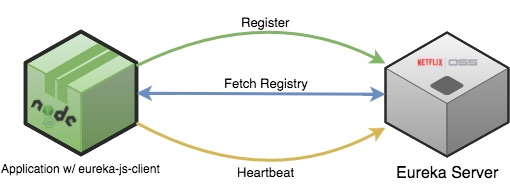

[eureka-js-client](https://github.com/jquatier/eureka-js-client) 是 [Eureka](https://github.com/Netflix/eureka) 客户端的` JavaScript `实现。

> ` Eureka `是一种` RESTful `（表现层状态转化）服务，主要用于` AWS `云中，用于中间层服务器的发现、负载平衡和故障转移。它在` Netflix `中端基础设施中发挥着关键作用。



## 使用方法

### 安装

```bash
npm install eureka-js-client --save
```

### 在` Nodejs `应用中加入` Eureka `客户端

```js
import Eureka from 'eureka-js-client';

// Or, if you're not using a transpiler:
const Eureka = require('eureka-js-client').Eureka;

// example configuration
const client = new Eureka({
  // application instance information
  instance: {
    app: 'jqservice',
    hostName: 'localhost',
    ipAddr: '127.0.0.1',
    port: 8080,
    vipAddress: 'jq.test.something.com',
    dataCenterInfo: {
      name: 'MyOwn',
    },
  },
  eureka: {
    // eureka server host / port
    host: '192.168.99.100',
    port: 32768,
  },
});

```

` Eureka `会在当前工作目录下搜索` eureka-client.yml `这个配置文件，更进一步地，` Eureka `会根据不同的环境来覆盖` eureka-client.yml `，比如测试环境` eureka-client-test.yml `就会覆盖` eureka-client.yml `。

当前环境是开发环境还是生产环境取决于环境变量。环境变量优先级的顺序：` EUREKA_ENV --> NODE_ENV -> development ` (默认)

传递给` Eureka `构造函数的选项将会覆盖配置文件中的值。

你可以配置自定义的目录来加载配置文件，在传递给` Eureka `构造函数的选项中加上` cwd `属性就可以实现。

```js
const client = new Eureka({
  cwd: `${__dirname}/config`,
});
```

### 注册` Eureka `，开始应该心跳

```js
client.start();
```

### 取消注册，停止心跳

```js
client.stop();
```

## 自定义请求中间件

` eureka `客户端可以修改发送到` eureka `的[请求](https://www.npmjs.com/package/request)选项对象，并且这种修改的优先级高于` eureka `的调用。当添加权限验证比如` OAuth `或者其他自定义请求头时，这是很有用的。每个` eureka `请求都会调用这个函数，因此它强烈建议对中间件中任何长期存在的外部调用进行缓存或记忆。如果中间件返回的不是对象，则` eureka `请求将立即失败，并执行重试，如果有配置重试。

```js
const client = new Eureka({
  requestMiddleware: (requestOpts, done) => {
    requestOpts.auth = {
      user: 'username',
      password: 'yourpassword'
    };
    done(requestOpts)
  }
})
```

## 为` AWS `环境配置

对于` AWS `环境(` dataCenterInfo.name == 'Amazon' `)，客户端具有请求` Eureka `服务器所需的` AWS `元数据的内置逻辑。[查看详情](https://github.com/Netflix/eureka/wiki/Eureka-REST-operations)

```js
// example configuration for AWS
const client = new Eureka({
  // application instance information
  instance: {
    app: 'jqservice',
    port: 8080,
    vipAddress: 'jq.test.something.com',
    statusPageUrl: 'http://__HOST__:8080/info',
    healthCheckUrl: 'http://__HOST__:8077/healthcheck',
    homePageUrl: 'http://__HOST__:8080/',
    dataCenterInfo: {
      name: 'Amazon',
    },
  },
  eureka: {
    // eureka server host / port / EC2 region
    host: 'eureka.test.mydomain.com',
    port: 80,
  },
});

```

注意：

1. 在此配置下，实例` hostName `和` ipAddr `将被设置为` AWS `元数据提供的公共` host `和公共` IP `。你可以设置` eureka.useLocalMetadata `设置为` true `以使用私有主机和私有` IP `地址代替。
2. 如果需要使用` IP `地址作为主机名进行注册，请设置` eureka.preferIpAddress `为` true `。这可能与` eureka.useLocalMetadata `结合使用用于选择私有或公有` IP `。
3. 对于` status和healthcheck url `，您可以从元数据中使用` __HOST__ `替换来作为主机。
4. 如果你想在` AWS `环境中提供自己的元数据，可以通过将` config.eureka.fetchMetadata `设置为` false `来禁用元数据获取。

## 用` DNS `来查找` Eureka `服务器

如果你有多个可用性区域，并且根据` Wiki `文章[在` EC2 `中部署` Eureka `服务器](https://github.com/Netflix/eureka/wiki/Deploying-Eureka-Servers-in-EC2#configuring-eips-using-dns)设置了` DNS `条目，那么您需要将` config.eureka.useDns `设置为` true `并将` config.eureka.ec2Region `添加到当前区域(通常可以通过环境变量将其注入应用程序，或者在启动时直接传入)。

这将导致客户端使用` config.eureka.host `和` config.eureka.ec2Region `执行` DNS `查找。上面的` Wiki `文章还描述了` DNS TXT `记录的命名约定。只要` DNS `记录符合相同的约定，这个特性也可以在非` ec2 `环境中工作。默认情况下，` DNS `解析结果缓存在内存中，每` 5 `分钟刷新一次(设置` config.eureka.clusterRefreshInterval `来覆盖)。

### 地区亲和力

默认情况下，客户端将首先尝试连接与当前所在可用性区域相同的` Eureka `服务器。如果在实例元数据中没有设置` availability-zone `，那么将选择一个随机服务器。这也适用于静态配置集群(由` zone `映射，参见下面)。要禁用该特性，请将` config.eureka.preferSameZone `设置为` false `，然后将选择一个随机服务器。

## 配置静态的服务器列表

虽然推荐使用` DNS `(上面介绍的)方法来解析` Eureka `集群，但你也可以按区域静态配置` Eureka `服务器列表，或者只使用简单的默认列表。在使用这种方法时，请确保提供完整的协议、主机、端口和` Eureka REST `服务(通常是` /apps/ `)的路径。

### 静态集群配置(按区域映射)

```js
const client = new Eureka({
  instance: {
    ... // application instance information
  },
  eureka: {
    availabilityZones: {
      'us-east-1': ['us-east-1c', 'us-east-1d', 'us-east-1e']
    },
    serviceUrls: {
      'us-east-1c': [
        'http://ec2-fake-552-627-568-165.compute-1.amazonaws.com:7001/eureka/v2/apps/',
        'http://ec2-fake-368-101-182-134.compute-1.amazonaws.com:7001/eureka/v2/apps/'
      ],
      'us-east-1d': [...],
      'us-east-1e': [...]
    }
  },
});
```

### 静态集群配置(列表)

```js
const client = new Eureka({
  instance: {
    ... // application instance information
  },
  eureka: {
    serviceUrls: {
      default: [
        'http://ec2-fake-552-627-568-165.compute-1.amazonaws.com:7001/eureka/v2/apps/',
        'http://ec2-fake-368-101-182-134.compute-1.amazonaws.com:7001/eureka/v2/apps/'
      ]
    }
  },
});
```

## 高级配置选项

   选项 |  默认值  | 描述
-- | -- | --
` requestMiddleware ` | ` noop ` | 自定义中间件函数来修改发送到` eureka `的[请求](https://www.npmjs.com/package/request)选项
` logger ` | ` console logging ` | ` eureka `客户端中日志的实现
` shouldUseDelta ` | ` false ` | 实验模式, 在更新时从` eureka `而不是完整注册表中获取增量
` eureka.maxRetries ` | ` 3 ` | 所有请求重试发送到 `eureka `的次数
` eureka.requestRetryDelay ` | ` 500 ` | 重试之间等待的毫秒数。这将乘以失败的重试次数。
` eureka.heartbeatInterval ` | ` 30000 ` | 心跳之间间隔的毫秒数
` eureka.registryFetchInterval ` | ` 30000 ` | 获取注册表之间等待的毫秒数
` eureka.registerWithEureka ` | ` true ` | 是否开启` Eureka `注册
` eureka.fetchRegistry ` | ` true ` | 是否开启获取注册表
` eureka.filterUpInstances `	| ` true ` | 是否开启实例过滤，通过` status === UP `
` eureka.servicePath ` | ` /eureka/v2/apps/ ` | ` eureka REST `服务的路径
` eureka.ssl ` | ` false ` | 是否开启` ssl `与` eureka `服务器的交互
` eureka.useDns ` | ` false ` | 通过` DNS `来查找` Eureka `服务器，[详情](https://github.com/jquatier/eureka-js-client#looking-up-eureka-servers-in-aws-using-dns)
` eureka.preferSameZone ` | ` true ` | 定位` Eureka `服务器时启用/禁用区域亲和性
` eureka.clusterRefreshInterval ` | ` 300000  ` | 刷新集群主机之间等待的毫秒数(仅` DNS `解析)
` eureka.fetchMetadata ` | ` true ` | 在` AWS `环境中获取` AWS `元数据，[详情](https://github.com/jquatier/eureka-js-client#configuring-for-aws-environments)
` eureka.useLocalMetadata ` | ` false ` | 在` AWS `环境中使用元数据中的本地` IP `和本地主机名
` eureka.preferIpAddress ` | ` false ` | 在` AWS `环境中使用` IP `地址(本地或公共)作为注册主机名

## 事件

` Eureka `客户端是` EventEmitter `的一个实例，提供了以下事件供消费:

` event ` | 提供的数据 | 描述
-- | -- | --
` started ` | ` N/A ` | 当` eureka `客户端完全注册并更新所有注册表时触发。
` registered ` | ` N/A ` | 当` eureka `客户端注册到` eureka `是触发
` deregistered ` | ` N/A ` | 当` eureka `客户端取消注册时触发
` heartbeat ` | ` N/A ` | 当` eureka `客户端成功更新与` eureka `的租约时触发。
` registryUpdated ` | ` N/A `| 当` eureka `客户端已成功更新其注册表时触发
