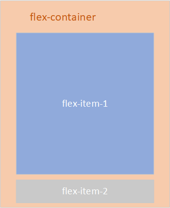

## 清除` Firefox `浏览器中输入框红色问题

**原因：**

如果一个表单控件具有` required `属性，当这个控件失效时，` Firefox `会自动为表单控件加上红色的边框。

**解决：**

```css
input,
textarea,
select {
  appearance: none;
  -moz-appearance: none;
  outline: none;
  -moz-outline: none;
  box-shadow: none;
  -moz-box-shadow: none;
}
```

## 解决字体自动放大问题（偶尔出现）

关键字：**Font Boosting**

当页面的` viewport ` 进行缩放后，浏览器为了让字体不过小显示，会自动对字体进行放大，一般文字较多时出现。

解决方案：给容器指定任意高度，如：**max-height: 9999999px**

## ` flex:1 `的兼容性问题

元素` flex-container `是` flex `布局，如图` 1 `，其中，对元素` flex-item-1 `设置` flex:1 `:



正常情况,页面应该如下图显示：


此时元素` flex-container `高度大于` body `高度，它是可以滚动的。

在大部分机型上显示都是没有问题的，但是在` vivo x7 `上有问题


在` vivo x7 `中，元素` flex-container `高度等于` body `高度，元素` flex-item-1 `内容显示不全，页面也无法滚动。

经过调试发现是` flex:1 `在` vivo x7 `中有问题，改成` flex:auto `就没问题了。
