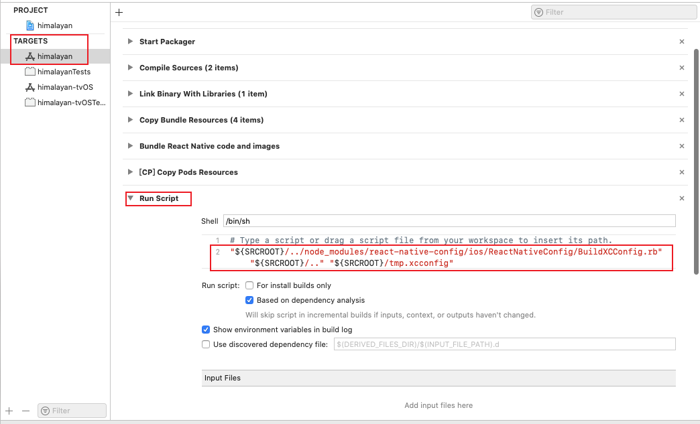

## 安装

1. 安装 [react-native-config](https://github.com/luggit/react-native-config)依赖：

```shell
yarn add react-native-config
```

2. 添加原生链接

```shell
cd ios && pod install && cd ..
```

## 使用 .env 中的配置

安装完成后，我们就可以在 Obj-C 类中使用 .env 中声明的变量了：

```Objective-C
// import header
#import "ReactNativeConfig.h"

// then read individual keys like:
NSString *apiUrl = [ReactNativeConfig envFor:@"API_URL"];

// or just fetch the whole config
NSDictionary *config = [ReactNativeConfig env];
```

但是如果想要在 Build settings 和 Info.plist 中使用的话，还需要额外的配置。比如 ios 的项目名称就是在info.plist配置的。

下面就来配置一下，让 info.plist使用 .env 里面的值。

1. 进入 项目的 ios 目录，双击 himalayan.xcworkspace，xcode就会打开项目。

2. 右键项目名称，点击 New File... 菜单：


3. 创建一个配置文件：


名称使用默认的就可以了，在target 里面选择 himalayan：


4. 编辑Config.xcconfig:

```
#include? "tmp.xcconfig"
```


因为 tmp.xcconfig 是动态生成的，所以不用提交到 git

```.gitignore
# react-native-config codegen
ios/tmp.xcconfig
```

5. 应用配置文件

想要使用配置文件，我们还需要在 Debug 和 Release 中做配置：


点击targets的 himalayan,打开  build phase

点击加号，创建一个脚本：


在脚本里面添加代码：

```shell
"${SRCROOT}/../node_modules/react-native-config/ios/ReactNativeConfig/BuildXCConfig.rb" "${SRCROOT}/.." "${SRCROOT}/tmp.xcconfig"
```


6. 最后，我们就可以在 info.plist 使用 .env 中的配置了


