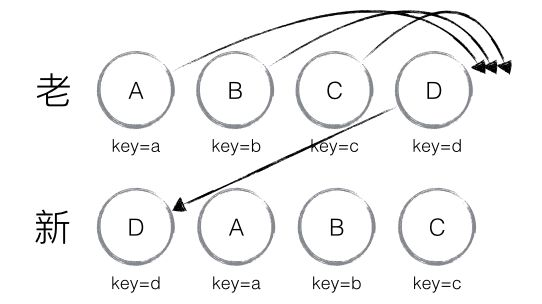

` React `最大的亮点应该就是将` virtual dom `和高效的` diff `算法结合。

## 一、` React `对` diff `算法的设想

[传统的` diff `算法](https://grfia.dlsi.ua.es/ml/algorithms/references/editsurvey_bille.pdf)通过循环递归对接点进行一次对比，时间复杂度为` O(n^3) `，其中` n `指` Dom `树中元素的个数。这意味着如果要展示` 1000 `个节点，就要依次执行上十亿次的比较。这种指数型的性能消耗对于前端渲染场景来说代价太高了！现今的` CPU ` 每秒钟能执行大约` 30 `亿条指令，即便是最高效的实现，也不可能在一秒内计算出差异情况。

` React `为了提高` diff `算法效率，基于下面的假设，实现了一个时间复杂度为` O(n) `的` diff `算法：

1. 两个不同类型的元素将产生不同的树。
2. 开发者可以通过指定` key `属性值，示意哪些子元素可能是稳定的。

实践中，上述假设适用于大部分应用场景。

### ` 1.1 ` 假设一

当对比两棵树时，` React `首先比较两个根节点。根节点的` type `不同，其行为也不同。

#### ` 1.1.1 ` 不同类型的元素

每当根元素有不同类型，` React `将卸载旧树并重新构建新树。

当树被卸载，旧的` DOM `节点将被销毁。组件实例会调用` componentWillUnmount() `。当构建一棵新树，新的` DOM `节点被插入到` DOM `中。组件实例将依次调用` componentWillMount() ` 和` componentDidMount() `。任何与旧树有关的状态都将丢弃。

例如，以下节点对比之后：

```html
<div>
  <Counter />
</div>

<span>
  <Counter />
</span>
```

这将会销毁旧的` Counter `并重装新的` Counter `。

#### ` 1.1.2 ` 相同类型的` DOM `元素

- 对于类型相同的` React DOM ` 元素，` React `会对比两者的属性是否相同，只更新不同的属性
- 当处理完这个` DOM `节点，` React `就会递归处理子节点。

```html
<!-- 旧 -->
<div className="before" title="stuff" />
<!-- 新 -->
<div className="after" title="stuff" />
<!-- 只更新：className 属性 -->

<!-- 旧 -->
<div style={{color: 'red', fontWeight: 'bold'}} />
<!-- 新 -->
<div style={{color: 'green', fontWeight: 'bold'}} />
<!-- 只更新：color属性 -->
```

#### ` 1.1.3 ` 相同类型的组件元素

当组件更新时，实例仍保持一致，以让状态能够在渲染之间保留。` React `通过更新底层组件实例的` props `来产生新元素，并在底层实例上依次调用` componentWillReceiveProps() `和` componentWillUpdate()  `方法。

接下来，` render() `方法被调用，同时对比算法会递归处理之前的结果和新的结果。

#### ` 1.1.4 ` 递归子节点

默认时。当递归` DOM `节点的子节点，` React `仅在同一时间点递归两个子节点列表，并在有不同时产生一个变更。

例如，当在子节点末尾增加一个元素，两棵树的转换效果很好：

```html
<ul>
  <li>first</li>
  <li>second</li>
</ul>

<ul>
  <li>first</li>
  <li>second</li>
  <li>third</li>
</ul>
```

若在开始位置插入元素则会使得性能很棘手。例如，两棵树的转换效果则比较糟糕：

```html
<ul>
  <li>Duke</li>
  <li>Villanova</li>
</ul>

<ul>
  <li>Connecticut</li>
  <li>Duke</li>
  <li>Villanova</li>
</ul>
```

` React `会调整每个子节点，不会意识到可以完整保留` <li>Duke</li> `和` <li>Villanova</li> `子树。低效成了一个问题。


### ` 1.2 ` 假设二：` Key `

为解决该问题，` React `支持了一个` key `属性。当子节点有` key `时，` React `使用` key `来匹配原本树的子节点和新树的子节点。

## 二、` diff `解析

基于以上假设，` React `分别对` tree diff `、` component diff `以及` element diff `进行算法优化

### `2.1 ` ` tree diff `

` React `对不同类型的节点的处理逻辑我们很容易得到推论，那就是` React `的` DOM Diff `算法实际上只会对树进行逐层比较，两棵树只会对同一层次的节点进行比较，如下所述：


` React `只会对相同颜色方框内的` DOM `节点进行比较，即同一个父节点下的所有子节点。当发现节点已经不存在，则该节点及其子节点会被完全删除掉，不会用于进一步的比较。这样只需要对树进行一次遍历，便能完成整个` DOM `树的比较。

```js
updateChildren: function(nextNestedChildrenElements, transaction, context) {
  updateDepth++;
  var errorThrown = true;
  try {
    this._updateChildren(nextNestedChildrenElements, transaction, context);
    errorThrown = false;
  } finally {
    updateDepth--;
    if (!updateDepth) {
      if (errorThrown) {
        clearQueue();
      } else {
        processQueue();
      }
    }
  }
}
```

如果出现了` DOM `节点跨层级的移动操作，如下图，` React diff `会有怎样的表现呢


如图，` A `节点（包括其子节点）整个被移动到` D `节点下，由于` React ` 只会简单的考虑同层级节点的位置变换，而对于不同层级的节点，只有创建和删除操作。当根节点发现子节点中` A ` 消失了，就会直接销毁` A `；当` D `发现多了一个子节点` A `，则会创建新的` A `（包括子节点）作为其子节点。此时，` React diff `的执行情况：` create A -> create B -> create C -> delete A `。

由此可发现，当出现节点跨层级移动时，并不会出现想象中的移动操作，而是以` A ` 为根节点的树被整个重新创建，这是一种影响` React ` 性能的操作，因此` React `官方建议不要进行` DOM ` 节点跨层级的操作。

注意：在开发组件时，保持稳定的` DOM ` 结构会有助于性能的提升。例如，可以通过` CSS ` 隐藏或显示节点，而不是真的移除或添加` DOM `节点。

### ` 2.2 ` ` component diff `

` React `是基于组件构建应用的，对于组件间的比较所采取的策略也是简洁高效。

- 如果是同一类型的组件，按照原策略继续比较` virtual DOM tree `。
- 如果不是，则将该组件判断为` dirty component `，从而替换整个组件下的所有子节点。

- 对于同一类型的组件，有可能其` Virtual DOM ` 没有任何变化，如果能够确切的知道这点那可以节省大量的` diff `运算时间，因此` React `允许用户通过`  shouldComponentUpdate() `来判断该组件是否需要进行`  diff `。

如下图，当` component D `改变为` component G ` 时，即使这两个` component `结构相似，一旦` React `判断 ` D `和` G `是不同类型的组件，就不会比较二者的结构，而是直接删除` component D `，重新创建` component G ` 以及其子节点。虽然当两个` component ` 是不同类型但结构相似时，` React diff `会影响性能，但正如` React `官方博客所言：不同类型的 ` component `是很少存在相似` DOM tree ` 的机会，因此这种极端因素很难在实现开发过程中造成重大影响的。


### ` 2.3 ` ` element diff `

当节点处于同一层级时，` React diff ` 提供了三种节点操作，分别为：` INSERT_MARKUP `（插入）、` MOVE_EXISTING `（移动）和`  REMOVE_NODE `（删除）。

- ` INSERT_MARKUP `：新的` component `类型不在老集合里， 即是全新的节点，需要对新节点执行插入操作。
- ` MOVE_EXISTING `：在老集合有新` component `类型，且 ` element `是可更新的类型，` generateComponentChildren `已调用` receiveComponent `，这种情况下 ` prevChild=nextChild `，就需要做移动操作，可以复用以前的 ` DOM `节点。
- ` REMOVE_NODE `：老` component ` 类型，在新集合里也有，但对应的` element ` 不同则不能直接复用和更新，需要执行删除操作，或者老` component `不在新集合里的，也需要执行删除操作。

```js
function enqueueInsertMarkup(parentInst, markup, toIndex) {
  updateQueue.push({
    parentInst: parentInst,
    parentNode: null,
    type: ReactMultiChildUpdateTypes.INSERT_MARKUP,
    markupIndex: markupQueue.push(markup) - 1,
    content: null,
    fromIndex: null,
    toIndex: toIndex,
  });
}

function enqueueMove(parentInst, fromIndex, toIndex) {
  updateQueue.push({
    parentInst: parentInst,
    parentNode: null,
    type: ReactMultiChildUpdateTypes.MOVE_EXISTING,
    markupIndex: null,
    content: null,
    fromIndex: fromIndex,
    toIndex: toIndex,
  });
}

function enqueueRemove(parentInst, fromIndex) {
  updateQueue.push({
    parentInst: parentInst,
    parentNode: null,
    type: ReactMultiChildUpdateTypes.REMOVE_NODE,
    markupIndex: null,
    content: null,
    fromIndex: fromIndex,
    toIndex: null,
  });
}
```

如下图，老集合中包含节点：` A `、` B `、` C `、` D `，更新后的新集合中包含节点：` B `、` A `、` D `、` C `，此时新老集合进行` diff `差异化对比，发现` B != A `，则创建并插入` B `至新集合，删除老集合` A `；以此类推，创建并插入` A `、` D `和` C `，删除` B `、` C `和` D `。


` React `发现这类操作繁琐冗余，因为这些都是相同的节点，但由于位置发生变化，导致需要进行繁杂低效的删除、创建操作，其实只要对这些节点进行位置移动即可。

针对这一现象，` React ` 提出优化策略：允许开发者对同一层级的同组子节点，添加唯一` key `进行区分，虽然只是小小的改动，性能上却发生了翻天覆地的变化！

新老集合所包含的节点，如下图所示，新老集合进行` diff ` 差异化对比，通过` key ` 发现新老集合中的节点都是相同的节点，因此无需进行节点删除和创建，只需要将老集合中节点的位置进行移动，更新为新集合中节点的位置，此时` React `给出的` diff ` 结果为：` B `、` D `不做任何操作，` A `、` C `进行移动操作，即可。


那么，如此高效的` diff ` 到底是如何运作的呢？让我们通过源码进行详细分析。

首先对新集合的节点进行循环遍历，` for (name in nextChildren) `，通过唯一` key ` 可以判断新老集合中是否存在相同的节点，` if (prevChild === nextChild) `，如果存在相同节点，则进行移动操作，但在移动前需要将当前节点在老集合中的位置与` lastIndex `进行比较，` if (child._mountIndex < lastIndex) `，则进行节点移动操作，否则不执行该操作。这是一种顺序优化手段，` lastIndex ` 一直在更新，表示访问过的节点在老集合中最右的位置（即最大的位置），如果新集合中当前访问的节点比` lastIndex ` 大，说明当前访问节点在老集合中就比上一个节点位置靠后，则该节点不会影响其他节点的位置，因此不用添加到差异队列中，即不执行移动操作，只有当访问的节点比` lastIndex ` 小时，才需要进行移动操作，流程如下：


以上图为例，可以更为清晰直观的描述` diff ` 的差异对比过程：

- 从新集合中取得` B `，判断老集合中存在相同节点 ` B `，通过对比节点位置判断是否进行移动操作，` B ` 在老集合中的位置` B._mountIndex = 1 `，此时` lastIndex = 0 `，不满足` child._mountIndex < lastIndex  `的条件，因此不对` B `进行移动操作；更新` lastIndex = Math.max(prevChild._mountIndex, lastIndex) `，其中 ` prevChild._mountIndex `表示` B `在老集合中的位置，则 ` lastIndex ＝ 1 `，并将` B ` 的位置更新为新集合中的位置` prevChild._mountIndex = nextIndex `，此时新集合中 ` B._mountIndex = 0 `，` nextIndex++ ` 进入下一个节点的判断。

- 从新集合中取得` A `，判断老集合中存在相同节点 ` A `，通过对比节点位置判断是否进行移动操作，` A ` 在老集合中的位置` A._mountIndex = 0 `，此时` lastIndex = 1 `，满足` child._mountIndex < lastIndex `的条件，因此对` A `进行移动操作` enqueueMove(this, child._mountIndex, toIndex) `，其中` toIndex `其实就是 ` nextIndex `，表示` A `需要移动到的位置；更新 ` lastIndex = Math.max(prevChild._mountIndex, lastIndex) `，则` lastIndex ＝ 1 `，并将` A ` 的位置更新为新集合中的位置` prevChild._mountIndex = nextIndex `，此时新集合中 `A._mountIndex = 1 `，` nextIndex++ `进入下一个节点的判断。

- 从新集合中取得` D `，判断老集合中存在相同节点 ` D `，通过对比节点位置判断是否进行移动操作，` D ` 在老集合中的位置` D._mountIndex = 3 `，此时` lastIndex = 1 `，不满足` child._mountIndex < lastIndex `的条件，因此不对` D `进行移动操作；更新` lastIndex = Math.max(prevChild._mountIndex, lastIndex) `，则 ` lastIndex ＝ 3 `，并将` D `的位置更新为新集合中的位置 ` prevChild._mountIndex = nextIndex `，此时新集合中` D._mountIndex = 2 `，` nextIndex++ ` 进入下一个节点的判断。

- 从新集合中取得` C `，判断老集合中存在相同节点`  C `，通过对比节点位置判断是否进行移动操作，` C ` 在老集合中的位置` C._mountIndex = 2 `，此时` lastIndex = 3 `，满足` child._mountIndex < lastIndex ` 的条件，因此对` C `进行移动操作` enqueueMove(this, child._mountIndex, toIndex) `；更新` lastIndex = Math.max(prevChild._mountIndex, lastIndex) `，则 ` lastIndex ＝ 3 `，并将` C `的位置更新为新集合中的位置 ` prevChild._mountIndex = nextIndex `，此时新集合中 ` C._mountIndex = 3 `，` nextIndex++ ` 进入下一个节点的判断，由于 C 已经是最后一个节点，因此 ` diff `到此完成。

以上主要分析新老集合中存在相同节点但位置不同时，对节点进行位置移动的情况，如果新集合中有新加入的节点且老集合存在需要删除的节点，那么` React diff ` 又是如何对比运作的呢？

以下图为例：


- 从新集合中取得` B `，判断老集合中存在相同节点` B `，由于` B `在老集合中的位置` B._mountIndex = 1 `，此时` lastIndex = 0 `，因此不对` B `进行移动操作；更新` lastIndex ＝ 1 `，并将` B `的位置更新为新集合中的位置` B._mountIndex = 0 `，` nextIndex++ `进入下一个节点的判断。

- 从新集合中取得` E `，判断老集合中不存在相同节点 ` E `，则创建新节点` E `；更新` lastIndex ＝ 1 `，并将` E  `的位置更新为新集合中的位置，` nextIndex++ `进入下一个节点的判断。

- 从新集合中取得` C `，判断老集合中存在相同节点` C `，由于` C `在老集合中的位置` C._mountIndex = 2 `，` lastIndex = 1 `，此时` C._mountIndex > lastIndex `，因此不对` C `进行移动操作；更新` lastIndex ＝ 2 `，并将` C `的位置更新为新集合中的位置，` nextIndex++ `进入下一个节点的判断。

- 从新集合中取得` A `，判断老集合中存在相同节点`  A `，由于` A `在老集合中的位置` A._mountIndex = 0 `，` lastIndex = 2 `，此时` A._mountIndex < lastIndex `，因此对` A `进行移动操作；更新` lastIndex ＝ 2 `，并将` A `的位置更新为新集合中的位置，` nextIndex++ `进入下一个节点的判断。

- 当完成新集合中所有节点` diff ` 时，最后还需要对老集合进行循环遍历，判断是否存在新集合中没有但老集合中仍存在的节点，发现存在这样的节点` D `，因此删除节点` D `，到此` diff `全部完成。

```js
_updateChildren: function(nextNestedChildrenElements, transaction, context) {
  var prevChildren = this._renderedChildren;
  var nextChildren = this._reconcilerUpdateChildren(
    prevChildren, nextNestedChildrenElements, transaction, context
  );
  if (!nextChildren && !prevChildren) {
    return;
  }
  var name;
  var lastIndex = 0;
  var nextIndex = 0;
  for (name in nextChildren) {
    if (!nextChildren.hasOwnProperty(name)) {
      continue;
    }
    var prevChild = prevChildren && prevChildren[name];
    var nextChild = nextChildren[name];
    if (prevChild === nextChild) {
      // 移动节点
      this.moveChild(prevChild, nextIndex, lastIndex);
      lastIndex = Math.max(prevChild._mountIndex, lastIndex);
      prevChild._mountIndex = nextIndex;
    } else {
      if (prevChild) {
        lastIndex = Math.max(prevChild._mountIndex, lastIndex);
        // 删除节点
        this._unmountChild(prevChild);
      }
      // 初始化并创建节点
      this._mountChildAtIndex(
        nextChild, nextIndex, transaction, context
      );
    }
    nextIndex++;
  }
  for (name in prevChildren) {
    if (prevChildren.hasOwnProperty(name) &&
        !(nextChildren && nextChildren.hasOwnProperty(name))) {
      this._unmountChild(prevChildren[name]);
    }
  }
  this._renderedChildren = nextChildren;
},
// 移动节点
moveChild: function(child, toIndex, lastIndex) {
  if (child._mountIndex < lastIndex) {
    this.prepareToManageChildren();
    enqueueMove(this, child._mountIndex, toIndex);
  }
},
// 创建节点
createChild: function(child, mountImage) {
  this.prepareToManageChildren();
  enqueueInsertMarkup(this, mountImage, child._mountIndex);
},
// 删除节点
removeChild: function(child) {
  this.prepareToManageChildren();
  enqueueRemove(this, child._mountIndex);
},

_unmountChild: function(child) {
  this.removeChild(child);
  child._mountIndex = null;
},

_mountChildAtIndex: function(
  child,
  index,
  transaction,
  context) {
  var mountImage = ReactReconciler.mountComponent(
    child,
    transaction,
    this,
    this._nativeContainerInfo,
    context
  );
  child._mountIndex = index;
  this.createChild(child, mountImage);
},
```

当然，` React diff ` 还是存在些许不足与待优化的地方，如下图所示，若新集合的节点更新为：` D `、` A `、` B `、` C `，与老集合对比只有` D `节点移动，而` A `、` B `、` C `仍然保持原有的顺序，理论上` diff `应该只需对` D ` 执行移动操作，然而由于` D ` 在老集合的位置是最大的，导致其他节点的` _mountIndex < lastIndex `，造成` D `没有执行移动操作，而是` A `、` B `、` C `全部移动到` D `节点后面的现象。



建议：在开发过程中，尽量减少类似将最后一个节点移动到列表首部的操作，当节点数量过大或更新操作过于频繁时，在一定程度上会影响` React `的渲染性能。

## 总结

- ` React `通过制定大胆的` diff `策略，将` O(n3) ` 复杂度的问题转换成` O(n) `复杂度的问题；
- ` React `通过分层求异的策略，对` tree diff ` 进行算法优化；
- ` React `通过相同类生成相似树形结构，不同类生成不同树形结构的策略，对` component diff `进行算法优化；
- ` React `通过设置唯一 `key `的策略，对` element diff ` 进行算法优化；
- 建议，在开发组件时，保持稳定的` DOM ` 结构会有助于性能的提升；
- 建议，在开发过程中，尽量减少类似将最后一个节点移动到列表首部的操作，当节点数量过大或更新操作过于频繁时，在一定程度上会影响` React `的渲染性能。

## 参考文献

[` Reconciliation diff `](https://reactjs.org/docs/reconciliation.html)

[` diff `算法 中文文档](https://react.docschina.org/docs/reconciliation.html)

[` React `源码剖析系列 － 不可思议的` react diff `](https://zhuanlan.zhihu.com/p/20346379)

[深入浅出` React `（四）：虚拟` DOM Diff `算法解析
](http://www.infoq.com/cn/articles/react-dom-diff?from=timeline&isappinstalled=0)
