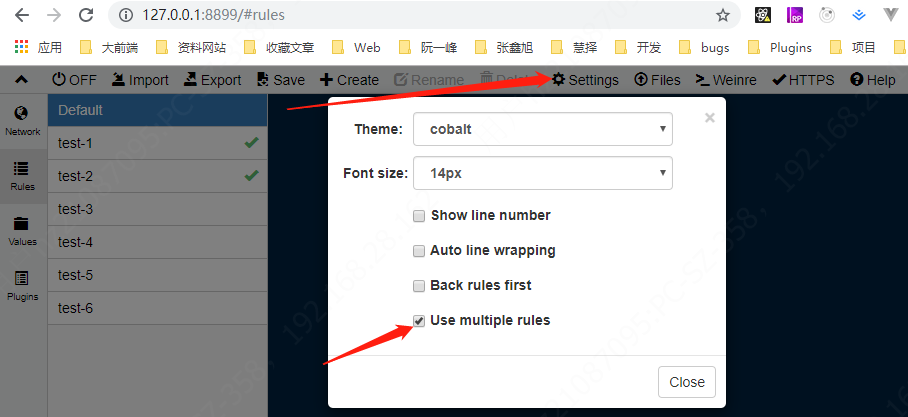

` whistle ` 是基于 ` Node ` 实现的跨平台抓包调试代理工具。

` whistle `的使用需要经过下面的步骤，缺一不可：
1. 安装` nodejs `
2. 安装` whistle `
3. 启动` whistle `
4. 配置代理
5. 安装根证书

## 安装 whistle

```sh
npm install -g whistle
```
```sh
npm install whistle -g --registry=https://registry.npm.taobao.org
```
### 常用命令

```
# 启动 whistle
w2 start
# 启动时指定端口号，默认是 8899
w2 start -p 8998

# 停止 whistle
w2 stop

# 重启 whistle
w2 restart

# 更多内容请查看命令行帮助：
w2 help
```

## 启动 whistle

```sh
w2 start
```

` whistle `启动成功后，在浏览器地址栏输入` http://127.0.0.1:8899 `（使用默认端口` 8899 `），可以看到下面的页面：


## 配置代理

代理有全局代理和浏览器代理等多种方式，具体可以看[这里](http://wproxy.org/whistle/install.html)。这里就只说浏览器代理。

### 浏览器代理

安装 [` SwitchyOmega `](https://chrome.google.com/webstore/detail/proxy-switchyomega/padekgcemlokbadohgkifijomclgjgif)

` SwitchyOmega `是一个` Chrome `插件可以快速切换代理环境配合` Whistle `使用。可以在` Chrome `或者` Firefox `的插件市场搜索，也可以使用下面的地址离线安装。

离线安装地址：[https://github.com/FelisCatus/SwitchyOmega/releases](https://github.com/FelisCatus/SwitchyOmega/releases)

` SwitchyOmega `插件安装完成后，设置一下:


 ### 配置代理规则

开发中用的比较多的有` network `和` rules `板块，` network `可以抓取代理的接口包，` rule `则是可以查看和设置代理规则。如上图，其中` Default `是` whistle `默认的代理规则，下面的` test-1 `、` test-2...... `等都是代理规则。当你勾选上规则时，表示启用规则。

` whistle `还支持同时使用多个代理规则，在` settings `里面勾选 “` use multiple rules `”就可以了。



## 安装根证书

下面是在` Windows `系统中安装根证书，如果你不是` Windows `系统，请查看[这里](http://wproxy.org/whistle/webui/https.html)。

点击` HTTPS `，下载根证书，开启捕获` HTTPS `请求：


根证书是一个名为` rootCA.crt `的文件，点击这个文件来安装证书。


