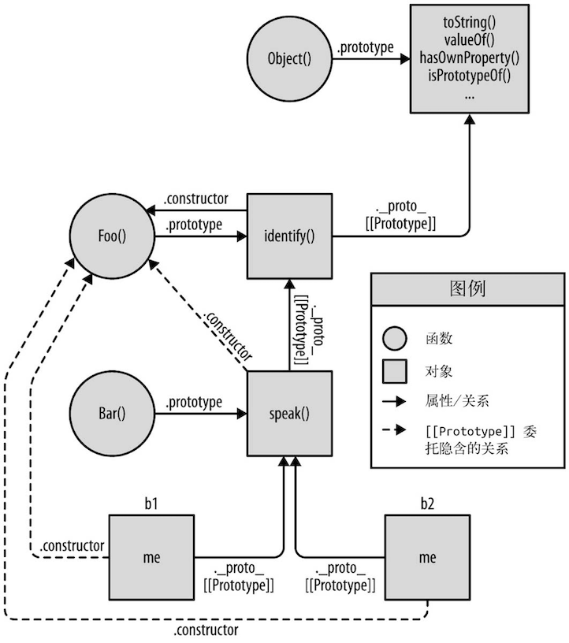

## 关于` this `

### 1.1 为什么要用` this `

```js
function identify () {
  return this.name.toUpperCase();
}

function speak () {
  var greeting = "Hello, I'm " + identify.call(this);
  console.log(greeting);
}

var me = {
  name: "Kyle"
};

var you = {
  name: "Reader"
};

identify.call(me);
identity.call(you);

speak.call(me);
speak.call(you);
```

这段代码可以在不同的上下文对象（` me `和` you `）中重复使用函数` identify() `和` speak() `，不用针对每个对象编写不同版本的函数。

如果不使用` this `，那就需要给` identify() `和` speak() `显式传入一个上下文对象。

```js
function identify (context) {
  return context.name.toUpperCase();
}

function speak (context) {
  var greeting = "Hello, I'm " + identify.call(this);
  console.log(greeting);
}

identity.call(you);
speak.call(me);
```

然而，` this `提供了一种更优雅的方式来隐式“传递”一个对象引用，因此可以将` API `设计得更加简洁并且易于复用。

### 1.2 误解

有两种常见的对于` this `的解释，但是它们都是错误的。

#### 1.2.1 指向自身

人们很容易把` this `理解成指向函数自身，这个推断从英语的语法角度来说是说得通的。

那么为什么需要从函数内部引用函数自身呢？常见的原因是递归（从函数内部调用这个函数）或者可以写一个在第一次被调用后自己解除绑定的事件处理器。

我们先来分析一下这个模式，让大家看到` this `并不像我们所想的那样指向函数本身。

我们想要记录一下函数` foo `被调用的次数，思考一下下面的代码：

```js
function foo(num) {
  console.log('foo:', num);

  // 记录foo被调用的次数
  this.count++;
}

foo.count = 0;

var i;
for(i = 0; i < 10; i++) {
  if (i > 5) {
    foo(i);
  }
}
// foo: 6
// foo: 7
// foo: 8
// foo: 9

// foo 被调用了多少次？
console.log(foo.count); // 0
```

` console.log `语句产生了` 4 `条输出，证明` foo(..) `确实被调用了` 4 `次，但是` foo.count `仍然是` 0 `。

执行` foo.count = 0 `时，的确向函数对象` foo `添加了一个属性` count `。但是函数内部代码` this.count `中的` this `并不是指向那个函数对象，所以虽然属性名相同，根对象却并不相同，困惑随之产生。

> 负责的开发者一定会问“如果我增加的` count `属性和预期的不一样，那我增加的是哪个` count `? ”实际上，如果他深入探索的话，就会发现这段代码在无意中创建了一个全局变量` count `（原理参见第2章），它的值为` NaN `。当然，如果他发现了这个奇怪的结果，那一定会接着问：“为什么它是全局的，为什么它的值是` NaN `而不是其他更合适的值？”（参见第2章。）

遇到这样的问题时，许多开发者并不会深入思考为什么` this `的行为和预期的不一致，也不会试图回答那些很难解决但却非常重要的问题。他们只会回避这个问题并使用其他方法来达到目的，比如创建另一个带有` count `属性的对象。

```js
function foo(num) {
  console.log('foo:', num);

  // 记录foo被调用的次数
  data.count++;
}

var data = {
  count: 0
};

var i;
for(i = 0; i < 10; i++) {
  if (i > 5) {
    foo(i);
  }
}
// foo: 6
// foo: 7
// foo: 8
// foo: 9

// foo 被调用了多少次？
console.log(data.count); // 4
```

从某种角度来说这个方法确实“解决”了问题，但可惜它忽略了真正的问题——无法理解` this `的含义和工作原理，使用了一种更熟悉的技术：词法作用域。

**如果要从函数对象内部引用它自身，那只使用` this `是不够的。一般来说你需要通过一个指向函数对象的词法标识符（变量）来引用它。**

思考一下下面这两个函数：

```js
function foo() {
  foo.count = 4;
}

setTimeout(function() {
  // 匿名函数无法指向自身
}， 10);
```

` foo() `函数是具名函数，在它的内部可以使用` foo `来引用自身。

` setTimeout(..) `的回调函数是匿名函数，没有名称标识符，因此无法从函数内部引用自身。

所以，记录一下函数` foo `被调用的次数，另一种解决方法是使用` foo `标识符替代` this `来引用函数对象：

```js
function foo(num) {
  console.log('foo:', num);

  // 记录foo被调用的次数
  foo.count++;
}

foo.count = 0;

var i;
for(i = 0; i < 10; i++) {
  if (i > 5) {
    foo(i);
  }
}
// foo: 6
// foo: 7
// foo: 8
// foo: 9

// foo 被调用了多少次？
console.log(foo.count); // 4
```

这种方法同样回避了` this `的问题，并且完全依赖于变量` foo `的词法作用域。

另一种方法是强制` this `指向` foo `函数对象：

```js
function foo(num) {
  console.log('foo:', num);

  // 记录foo被调用的次数
  // 在当前的调用方式下，this 确实指向 foo
  this.count++;
}

foo.count = 0;

var i;
for(i = 0; i < 10; i++) {
  if (i > 5) {
    // 使用 call(...)可以确保 this 指向函数对象 foo 本身
    foo.call(foo, i);
  }
}
// foo: 6
// foo: 7
// foo: 8
// foo: 9

// foo 被调用了多少次？
console.log(foo.count); // 4
```

#### 1.2.2 它的作用域

第二种常见的误解是，` this `指向函数的作用域。这个问题有点复杂，因为在某种情况下它是正确的，但是在其他情况下它却是错误的。

**需要明确的是，` this `在任何情况下都不指向函数的词法作用域。**

思考一下下面的代码，它试图（但是没有成功）跨越边界，使用` this `来隐式引用函数的词法作用域:

```js
function foo() {
  var a = 2;
  this.bar();
}

function bar () {
  console.log(this.a)
}

foo(); // ReferenceError: a is not defined
```

首先，这段代码试图通过` this.bar() `来引用` bar() `函数。这样调用能成功纯属意外，我们之后会解释原因。

此外，编写这段代码的开发者还试图使用` this `联通` foo() `和` bar() `的词法作用域，从而让` bar() `可以访问` foo() `作用域里的变量` a `。这是不可能实现的，使用` this `不可能在词法作用域中查到什么。

### 1.3 this 到底是什么

**之前我们说过` this `是在运行时进行绑定的，并不是在编写时绑定，它的上下文取决于函数调用时的各种条件。` this `的绑定和函数声明的位置没有任何关系，只取决于函数的调用方式。**

**当一个函数被调用时，会创建一个活动记录（有时候也称为执行上下文）。这个记录会包含函数在哪里被调用（调用栈）、函数的调用方式、传入的参数等信息。this就是这个记录的一个属性，会在函数执行的过程中用到。**

## this 全面解析

每个函数的` this `是在调用时被绑定的，完全取决于函数的调用位置（也就是函数的调用方法）。

### 2.1 调用位置

调用位置就是函数在代码中被调用的位置（而不是声明的位置）。

只有仔细分析调用位置才能回答这个问题：这个` this `到底引用的是什么？

通常来说，寻找调用位置就是寻找“函数被调用的位置”，但是做起来并没有这么简单，因为某些编程模式可能会隐藏真正的调用位置。

最重要的是要分析调用栈（就是为了到达当前执行位置所调用的所有函数）

下面我们来看看到底什么是调用栈和调用位置：

```js
function baz() {
  // 当前调用栈：baz
  // 因此，当前调用位置是全局作用域

  console.log('baz');
  bar(); // bar 的调用位置
}

function bar () {
  // 当前调用栈：baz -> bar
  // 因此，当前调用位置是在 baz

  console.log('bar');
  foo(); // foo 的调用位置
}

function foo () {
  // 当前调用栈：baz -> bar -> foo
  // 因此，当前调用位置是在 bar 中

  console.log('foo');
}

baz(); // baz 的调用位置
```

需要分析出真正的调用位置的，因为它决定了` this `的绑定。

> 你可以把调用栈想象成一个函数调用链，就像我们在前面代码段的注释中所写的一样。但是这种方法非常麻烦并且容易出错。另一个查看调用栈的方法是使用浏览器的调试工具。绝大多数现代桌面浏览器都内置了开发者工具，其中包含` JavaScript `调试器。

### 2.2 绑定规则

我们来看看在函数的执行过程中调用位置如何决定` this `的绑定对象。

必须找到调用位置，然后判断需要应用下面四条规则中的哪一条。我们首先会分别解释这四条规则，然后解释多条规则都可用时它们的优先级如何排列。

#### 2.2.1 默认绑定

首先是最常用的函数调用类型：**独立函数调用**。可以把这条规则看作是无法应用其他规则时的默认规则。

思考一下下面的代码：

```js
function foo () {
  console.log(this.a);
}

var a = 2;
foo(); // 2
```

声明在全局作用域中的变量（` var a = 2; `）就是全局对象的一个属性。

而调用` foo() `函数时，应用了` this `的默认绑定，因此` this `指向全局对象，` this.a `被解析成全局变量` a `。

在代码中，` foo() `是直接使用不带任何修饰的函数引用进行调用的，因此只能使用默认绑定，无法应用其他规则。

如果使用严格模式（` strict mode `），则不能将全局对象用于默认绑定，因此` this `会绑定到` undefined `：

```js
function foo () {
  "use strict"
  console.log(this.a);
}

var a = 2;
foo(); // TypeError: this is undefined
```

这里有一个微妙但是非常重要的细节，虽然` this `的绑定规则完全取决于调用位置，但是只有` foo() `运行在非` strict mode `下时，默认绑定才能绑定到全局对象；在严格模式下调用` foo() `则不影响默认绑定：

```js
function foo () {
  console.log(this.a);
}

var a = 2;

(function() {
  "use strict";

  foo(); // 2 在严格模式下调用foo()不影响默认绑定
})();
```

#### 2.2.2 隐式绑定

**另一条需要考虑的规则是调用位置是否有上下文对象**，或者说是否被某个对象拥有或者包含，不过这种说法可能会造成一些误导。

```js
function foo () {
  console.log(this.a);
}

var obj = {
  a: 2,
  foo: foo
}

obj.foo(); // 2
```

上面的代码中，` foo() `是先定义，然后是被当做引用属性添加到` obj `中。但是无论是直接在` obj `中定义还是先定义再添加为引用属性，这个函数严格来说都不属于` obj `对象。

然而，调用位置会使用` obj `上下文来引用函数，因此你可以说函数被调用时，` obj `对象“拥有”或者“包含”它。

无论你如何称呼这个模式，**当` foo() `被调用时，它的前面确实加上了对` obj `的引用。当函数引用有上下文对象时，隐式绑定规则会把函数调用中的` this `绑定到这个上下文对象**。因为调用` foo() `时` this `被绑定到` obj `，因此` this.a `和` obj.a `是一样的。

**对象属性引用链中只有上一层或者说最后一层在调用位置中起作用。**

例子：

```js
function foo () {
  console.log(this.a);
}

var obj2 = {
  a: 42,
  foo: foo
}

var obj1 = {
  a: 2,
  obj2: obj2
}

obj1.obj2.foo(); // 42
```

**隐式丢失**

一个最常见的` this `绑定问题就是被隐式绑定的函数会丢失绑定对象，也就是说它会应用默认绑定，从而把` this `绑定到全局对象或者` undefined `上，取决于是否是严格模式。

```js
function foo () {
  console.log(this.a);
}

var obj = {
  a: 2,
  foo: foo
}

var bar = obj.foo; // 函数别名

var a = "oops, global"; // a 是全局对象的属性

bar(); //  oops, global
```

虽然` bar `是` obj.foo `的一个引用，但是实际上，它引用的是` foo `函数本身，因此此时的` bar() `其实是一个不带任何修饰的函数调用，因此应用了默认绑定。

一种更微妙、更常见并且更出乎意料的情况发生在传入回调函数时：

```js
function foo () {
  console.log(this.a)
}

function doFoo(fn) {
  // fn 其实引用的是foo

  fn(); // 调用位置
}

var obj = {
  a: 2,
  foo: foo,
};

var a = "oops, global" // a 是全局对象的属性
doFoo(obj.foo); // "oops, global"
```

参数传递其实就是一种隐式赋值，因此我们传入函数时也会被隐式赋值，所以结果和上一个例子一样。

如果把函数传入语言内置的函数而不是传入你自己声明的函数，会发生什么呢？结果是一样的，没有区别：

```js
function foo () {
  console.log(this.a)
}

var obj = {
  a: 2,
  foo: foo,
};

var a = "oops, global" // a 是全局对象的属性

setTimeout(obj.foo, 100); // "oops, global"
```

#### 2.2.3 显示绑定

在分析隐式绑定时，我们必须在一个对象内部包含一个指向函数的属性，并通过这个属性间接引用函数，从而把` this `间接（隐式）绑定到这个对象上。


那么如果我们不想在对象内部包含函数引用，而想在某个对象上强制调用函数，该怎么做呢？

` JavaScript `中的“所有”函数都有一些有用的特性，可以用来解决这个问题。具体点说，可以使用函数的` call(..) `和` apply(..) `方法

这两个方法的第一个参数是一个对象，是给` this `准备的，接着在调用函数时将其绑定到` this `。因为你可以直接指定` this `的绑定对象，因此我们称之为显式绑定。

例子：

```js
function foo () {
  console.log(this.a);
}

var obj = {
  a: 2
};

foo.call(obj); // 2
```

通过` foo.call(..) `，我们可以在调用` foo `时强制把它的` this `绑定到` obj `上。

如果你传入了一个原始值（字符串类型、布尔类型或者数字类型）来当作` this `的绑定对象，这个原始值会被转换成它的对象形式（也就是` new String(..) `、` new Boolean(..) `或者` new Number(..) `）。这通常被称为“装箱”。

可惜，显式绑定仍然无法解决我们之前提出的丢失绑定问题。

1. **硬绑定**

但是显式绑定的一个变种可以解决这个问题。

如下代码：

```js
function foo() {
  console.log(this.a);
}

var obj = {
  a: 2
};

var bar = function() {
  foo.call(obj);
};

bar(); // 2
setTimeout(bar, 100); // 2

// 硬绑定的 bar 不可能再修改它的 this
bar.call(window); // 2
```

我们创建了函数` bar() `，并在它的内部手动调用了` foo.call(obj) `，因此强制把` foo `的` this `绑定到了` obj `。无论之后如何调用函数` bar `，它总会手动在` obj `上调用` foo `。这种绑定是一种显式的强制绑定，因此我们称之为硬绑定。

硬绑定的典型应用场景就是创建一个包裹函数，负责接收参数并返回值：

```js
function foo(something) {
  console.log(this.a, something);
  return this.a + something;
}

var obj = {
  a: 2
};

var bar = function() {
  return foo.apply(obj, arguments)
};

var b = bar(3); // 2 3
console.log(b); // 5
```

另一种使用方法是创建一个可以重复使用的辅助函数：

```js
function foo(something) {
  console.log(this.a, something);
  return this.a + something;
}

// 简单的辅助绑定函数
function bind(fn, obj) {
  return function () {
    return fn.apply(obj, arguments)
  }
}

var obj = {
  a: 2
};

var bar = bind(foo, obj)

var b = bar(3); // 2 3
console.log(b); // 5
```

由于硬绑定是一种非常常用的模式，所以` ES5 `提供了内置的方法` Function.prototype.bind `，它的用法如下：

```js
function foo(something) {
  console.log(this.a, something);
  return this.a + something;
}

var obj = {
  a: 2
};

var bar = foo.bind(obj)

var b = bar(3); // 2 3
console.log(b); // 5
```

` bind(..) `会返回一个硬编码的新函数，它会把你指定的参数设置为` this `的上下文并调用原始函数。

**2. ` API `调用的“上下文”**

第三方库的许多函数，以及` JavaScript `语言和宿主环境中许多新的内置函数，都提供了一个可选的参数，通常被称为“上下文”（` context `），其作用和` bind(..) `一样，确保你的回调函数使用指定的` this `。

例子：

```js
function foo (el) {
  console.log(el, this.id);
}
var obj = {
  id: "awesome"
};

// 调用 foo(...)时把this 绑定到obj
[1, 2, 3].forEach(foo, obj);
// 1 awesome 2 awesome 3 awesome
```

#### 2.2.4 ` new `绑定

` JavaScript `也有一个` new `操作符，使用方法看起来也和那些面向类的语言一样，绝大多数开发者都认为` JavaScript `中` new `的机制也和那些语言一样。然而，` JavaScript `中` new `的机制实际上和面向类的语言完全不同。

首先我们重新定义一下` JavaScript `中的“构造函数”。在` JavaScript `中，构造函数只是一些使用` new `操作符时被调用的函数。它们并不会属于某个类，也不会实例化一个类。实际上，它们甚至都不能说是一种特殊的函数类型，它们只是被` new `操作符调用的普通函数而已。

包括内置对象函数（比如` Number(..) `）在内的所有函数都可以用` new `来调用，这种函数调用被称为构造函数调用。这里有一个重要但是非常细微的区别：实际上并不存在所谓的“构造函数”，只有对于函数的“构造调用”。

**使用new来调用函数，或者说发生构造函数调用时，会自动执行下面的操作：**

1. 创建一个新对象，作为将要返回的对象实例。
2. 这个新对象的原型，指向构造函数的` prototype `属性。
3. 这个新对象会绑定到函数调用的` this `。
4. 如果函数没有返回其他对象，那么` new `表达式中的函数调用会自动返回这个新对象。

` new `是最后一种可以影响函数调用时` this `绑定行为的方法，我们称之为` new `绑定。

### 2.3 优先级

现在我们已经了解了函数调用中` this `绑定的四条规则。但是，如果某个调用位置可以应用多条规则该怎么办？为了解决这个问题就必须给这些规则设定优先级。

毫无疑问，默认绑定的优先级是四条规则中最低的，所以我们可以先不考虑它。

隐式绑定和显式绑定哪个优先级更高？我们来测试一下：

```js
function foo () {
  console.log(this.a)
}

var obj1 = {
  a: 2,
  foo: foo
};

var obj2 = {
  a: 3,
  foo: foo
};

obj1.foo(); // 2
obj2.foo(); // 3

obj1.foo.call(obj2); // 3
obj2.foo.call(obj1); // 2
```

可以看到，显式绑定优先级更高，也就是说在判断时应当先考虑是否可以存在显式绑定。

现在我们需要搞清楚` new `绑定和隐式绑定的优先级谁高谁低：

```js
function foo(something) {
  this.a = something;
}

var obj1 = {
  foo: foo
};

var obj2 = {};

obj1.foo(2);
console.log(obj1.a); // 2

obj1.foo.call(obj2, 3);
console.log(obj2.a); // 3

var bar = new obj1.foo(4)
console.log(obj1.a); // 2
console.log(bar.a); // 4
```

可以看到` new `绑定比隐式绑定优先级高。

但是` new `绑定和显式绑定谁的优先级更高呢？

` Function.prototype.bind(..) `会创建一个新的包装函数，这个函数会忽略它当前的` this `绑定（无论绑定的对象是什么），并把我们提供的对象绑定到` this `上。

这样看起来硬绑定（也是显式绑定的一种）似乎比` new `绑定的优先级更高，无法使用` new `来控制` this `绑定。

我们看看是不是这样：

```js
function foo(something) {
  this.a = something;
}

var obj1 = { };

var bar = foo.bind(obj1);
bar(2);
console.log(obj1.a) // 2

var baz = new bar(3);
console.log(obj1.a); // 2
console.log(baz.a) // 3
```

` bar `被硬绑定到` obj1 `上，但是` new bar(3) `并没有像我们预计的那样把` obj1.a `修改为` 3 `。相反，` new `修改了硬绑定（到` obj1 `的）调用` bar(..) `中的` this `。因为使用了` new `绑定，我们得到了一个名字为` baz `的新对象，并且` baz.a `的值是` 3 `。

**判断` this `**

现在我们可以根据优先级来判断函数在某个调用位置应用的是哪条规则。可以按照下面的顺序来进行判断：

1. 函数是否在` new `中调用（` new `绑定）？如果是的话` this `绑定的是新创建的对象。

```js
var bar = new foo()
```

2. 函数是否通过` call、apply `（显式绑定）或者硬绑定调用？如果是的话，` this `绑定的是指定的对象。

```js
var bar = foo.call(obj2)
```

3. 函数是否在某个上下文对象中调用（隐式绑定）？如果是的话，` this `绑定的是那个上下文对象。

```js
var bar = obj1.foo()
```

4. 如果都不是的话，使用默认绑定。如果在严格模式下，就绑定到` undefined `，否则绑定到全局对象。

```js
var bar = foo()
```

### 2.4 绑定例外

规则总有例外，这里也一样。在某些场景下` this `的绑定行为会出乎意料，你认为应当应用其他绑定规则时，实际上应用的可能是默认绑定规则。

#### 2.4.1 被忽略的this

如果你把` null `或者` undefined `作为` this `的绑定对象传入` call `、` apply `或者` bind `，这些值在调用时会被忽略，实际应用的是默认绑定规则：

```js
function foo() {
  console.log(this.a);
}

var a = 2;

foo.call(null); // 2
```

那么什么情况下你会传入` null `呢？

一种非常常见的做法是使用` apply(..) `来“展开”一个数组，并当作参数传入一个函数。类似地，` bind(..) `可以对参数进行柯里化，这种方法有时非常有用：

```js
function foo(a, b) {
  console.log("a: ", a, ", b: ", b);
}
// 把数组“展开”成参数
foo.apply(null, [2, 3]); // a:2, b:3

// 使用 bind(...) 进行柯里化
var bar = foo.bind(null, 2);
bar(3); // // a:2, b:3
```

这两种方法都需要传入一个参数当作` this `的绑定对象。如果函数并不关心` this `的话，你仍然需要传入一个占位值，这时` null `可能是一个不错的选择，就像代码所示的那样。

然而，总是使用` null `来忽略` this `绑定可能产生一些副作用。如果某个函数确实使用了` this `（比如第三方库中的一个函数），那默认绑定规则会把` this `绑定到全局对象（在浏览器中这个对象是` window `），这将导致不可预计的后果（比如修改全局对象）。

显而易见，这种方式可能会导致许多难以分析和追踪的` bug `。

**更安全的` this `**

一种“更安全”的做法是传入一个特殊的对象，把` this `绑定到这个对象不会对你的程序产生任何副作用。我们可以创建一个对象——它就是一个空的非委托的对象。

如果我们在忽略` this `绑定时总是传入一个空对象，那就什么都不用担心了，因为任何对于` this `的使用都会被限制在这个空对象中，不会对全局对象产生任何影响。

在` JavaScript `中创建一个空对象最简单的方法都是` Object.create(null) `。` Object.create(null) `和` {} `很像，但是并不会创建` Object.prototype `这个委托，所以它比` {} `“更空”：

```js
function foo(a, b) {
  console.log("a: ", a, ", b: ", b);
}

var ø = Object.create(null);

// 把数组“展开”成参数
foo.apply(ø, [2, 3]); // a:2, b:3

// 使用 bind(...) 进行柯里化
var bar = foo.bind(ø, 2);
bar(3); // // a:2, b:3
```

#### 2.4.2 间接引用

另一个需要注意的是，你有可能（有意或者无意地）创建一个函数的“间接引用”，在这种情况下，调用这个函数会应用默认绑定规则。

间接引用最容易在赋值时发生：

```js
function foo () {
  console.log(this.a);
}

var a = 2;
var o = { a: 3, foo: foo };
var p = { a: 4 };

o.foo(); // 3
(p.foo = o.foo))(); // 2
```

赋值表达式` p.foo = o.foo `的返回值是目标函数的引用，因此调用位置是` foo() `而不是` p.foo() `或者` o.foo() `。根据我们之前说过的，这里会应用默认绑定。

#### 2.4.3 软绑定

之前我们已经看到过，硬绑定这种方式可以把` this `强制绑定到指定的对象（除了使用` new `时），防止函数调用应用默认绑定规则。问题在于，硬绑定会大大降低函数的灵活性，使用硬绑定之后就无法使用隐式绑定或者显式绑定来修改` this `。如果可以给默认绑定指定一个全局对象和` undefined `以外的值，那就可以实现和硬绑定相同的效果，同时保留隐式绑定或者显式绑定修改` this `的能力。

可以通过一种被称为软绑定的方法来实现我们想要的效果：

```js
if (!Function.prototype.softBind) {
  Function.prototype.softBind = function(obj) {
    var fn = this;
    // 捕获所有的 curried 参数
    var curried = [].slice.call(arguments, 1);

    var bound = function () {
      return fn.apply((!this || this === (window | global)) ? obj : this, curried.concat.apply(curried, arguments))
    };

    bound.prototype = Object.create(fn.prototype);
    return bound;
  }
}
```
除了软绑定之外，` softBind(..) `的其他原理和` ES5 `内置的` bind(..) `类似。它会对指定的函数进行封装，首先检查调用时的` this `，如果` this `绑定到全局对象或者` undefined `，那就把指定的默认对象` obj `绑定到` this `，否则不会修改` this `。此外，这段代码还支持可选的柯里化

下面我们看看` softBind `是否实现了软绑定功能：

```js
function foo() {
  console.log("name: " + this.name);
}

var obj = { name: "obj" };
var obj2 = { name: "obj2" };
var obj3 = { name: "obj3" };

var fooOBJ = foo.softBind(obj);

fooOBJ(); // name: obj

obj2.foo = foo.softBind(obj);
obj2.foo(); // name: obj2

fooOBJ.call(obj3); // name: obj3

setTimeout(obj2.foo, 10);
// name: obj
```

可以看到，软绑定版本的` foo() `可以手动将` this `绑定到` obj2 `或者` obj3 `上，但如果应用默认绑定，则会将` this `绑定到` obj `。

### 2.5 ` this `词法

箭头函数并不是使用` function `关键字定义的，而是使用操作符` => `定义的。箭头函数不使用` this `的四种标准规则，而是根据外层（函数或者全局）作用域来决定` this `。

```js
function foo() {
  return (a) => {
    // this 继承自foo()
    console.log(this.a);
  };
}

var obj1 = { a: 2 };
var obj2 = { a: 3 };

var bar = foo.call(obj1);
bar.call(obj2); // 2
```

箭头函数的绑定无法被修改。（` new `也不行！）

## 对象

### 3.1 类型

在` JavaScript `中一共有七种主要类型：

- ` string `
- ` number `
- ` boolean `
- ` null `
- ` undefined `
- ` Symbol `
- ` object `

**内置对象**

` JavaScript `中还有一些对象子类型，通常被称为内置对象。有些内置对象的名字看起来和简单基础类型一样，不过实际上它们的关系更复杂。

- ` String `
- ` Number `
- ` Boolean `
- ` Object `
- ` Function `
- ` Array `
- ` Date `
- ` RegExp `
- ` Error `

在` JavaScript `中，它们实际上只是一些内置函数。这些内置函数可以当作构造函数来使用，从而可以构造一个对应子类型的新对象。

```js
var strPrimitive = "I am a string";
typeof strPrimitive; // "string"
strPrimitive instanceof String; // false

var strObject = new String("I am a string");
strObject instanceof String; // true
```

原始值` "I am a string" `并不是一个对象，它只是一个字面量，并且是一个不可变的值。如果要在这个字面量上执行一些操作，比如获取长度、访问其中某个字符等，那需要将其转换为` String `对象。

不过，在必要时引擎会自动把字符串字面量转换成一个` String `对象，也就是说你并不需要显式创建一个对象。

> ` typeof null === "object" `是因为，不同的对象在底层都表示为二进制，在` JavaScript `中二进制前三位都为` 0 `的话会被判断为` object `类型，` null `的二进制表示全是` 0 `，自然前三位也是` 0 `，所以执行 ` typeof null `时会返回` "object" `

### 3.2 内容

#### 3.2.1 存在性

```js
var myObject = {
  a: 2
};

myObject.b; // undefined

var myObject1 = {
  a: 2,
  b: undefined
};

myObject1.b; // undefined
```

对象中的属性访问返回值可能是` undefined `，但是这个值可能是属性中存储的` undefined `，也有可能是因为属性不存在，所以返回` undefined `。

那如何区分这两种情况呢？

```js
var myObject = {
  a: 2
};

("a" in myObject); // true
("b" in myObject); // false

myObject.hasOwnProperty("a"); // true
myObject.hasOwnProperty("b"); // false
```

in操作符会检查属性是否在对象及其` [[Prototype]] `原型链中。相比之下，` hasOwnProperty(..) `只会检查属性是否在` myObject `对象中，不会检查` [[Prototype]] `链。

所有的普通对象都可以通过对于` Object.prototype `的委托来访问` hasOwnProperty(..) `，但是有的对象可能没有连接到` Object.prototype `（通过` Object.create(null) `来创建）。在这种情况下，形如` myObejct.hasOwnProperty(..) `就会失败。

这时可以使用一种更加强硬的方法来进行判断：` Object.prototype.hasOwnProperty.call(myObject, "a") `，它借用基础的` hasOwnProperty(..) `方法并把它显式绑定到` myObject `上。

## 混合对象“类”

面向类的设计模式：实例化（` instantiation `）、继承（` inheritance `）和（相对）多态（` polymorphism `）。

面向对象编程强调的是数据和操作数据的行为本质上是互相关联的（当然，不同的数据有不同的行为），因此好的设计就是把数据以及和它相关的行为打包（或者说封装）起来。

类的一个核心概念是多态，这个概念是说父类的通用行为可以被子类用更特殊的行为重写。实际上，相对多态性允许我们从重写行为中引用基础行为。

过程化编程，这种代码只包含过程（函数）调用，没有高层的抽象。

## 原型

### 5.1 ` [[Prototype]] `

` JavaScript `中的对象有一个特殊的` [[Prototype]] `内置属性，其实就是对于其他对象的引用。

> 对象的` [[Prototype]] `链接可以为空，虽然很少见。

当引用对象的属性时，如果对象本身有这个属性，就直接使用它，如果没有，就会到对象的` [[Prototype]] `链上寻找它：

```js
var anotherObject = {
  a: 2
};

// 创建一个关联到 anotherObject 的对象
var myObject = Object.create(anotherObject);

myObject.a; // 2
```

> ` Object.create(..) `会创建一个对象并把这个对象的` [[Prototype]] `关联到指定的对象。

现在` myObject `对象的` [[Prototype]] `关联到了` anotherObject `。显然` myObject.a `并不存在，但是尽管如此，属性访问仍然成功地（在` anotherObject `中）找到了值` 2 `。

但是，如果` anotherObject `中也找不到` a `并且` [[Prototype]] `链不为空的话，就会继续查找下去。

#### 5.1.1 ` Object.prototype `

但是到哪里是` [[Prototype]] `的“尽头”呢？

所有普通的` [[Prototype]] `链最终都会指向内置的` Object.prototype `。

#### 5.1.2 属性设置和屏蔽

给一个对象设置属性并不仅仅是添加一个新属性或者修改已有的属性值。现在我们完整地讲解一下这个过程：

```js
myObject.foo = "bar";
```

如果` myObject `对象中包含名为` foo `的普通数据访问属性，这条赋值语句只会修改已有的属性值。

如果` foo `不是直接存在于` myObject `中，` [[Prototype]] `链就会被遍历。如果原型链上找不到` foo `, ` foo `就会被直接添加到` myObject `上。

然而，如果` foo `存在于原型链上层，赋值语句` myObject.foo = "bar" `的行为就会有些不同（而且可能很出人意料）。稍后我们会进行介绍。

如果属性名` foo `既出现在` myObject `中也出现在` myObject `的` [[Prototype]] `链上层，那么就会发生屏蔽。` myObject `中包含的` foo `属性会屏蔽原型链上层的所有` foo `属性，因为` myObject.foo `总是会选择原型链中最底层的` foo `属性。

下面我们分析一下如果` foo `不直接存在于` myObject `中而是存在于原型链上层时` myObject.foo = "bar" `会出现的三种情况。

1. 如果在` [[Prototype]] `链上层存在名为` foo `的普通数据访问属性，并且它的属性描述符` writable = true `，那就会直接在` myObject `中添加一个名为` foo `的新属性，它是屏蔽属性。

2. 如果在` [[Prototype]] `链上层存在` foo `，但是它的属性描述符` writable = false `，那么无法修改已有属性或者在` myObject `上创建屏蔽属性。如果运行在严格模式下，代码会抛出一个错误。否则，这条赋值语句会被忽略。总之，不会发生屏蔽。

3. 如果在` [[Prototype]] `链上层存在` foo `并且它是一个` setter `，那就一定会调用这个` setter `。` foo `不会被添加到（或者说屏蔽于）` myObject `，也不会重新定义` foo `这个` setter `。

如果你希望在第二种和第三种情况下也屏蔽` foo `，那就不能使用` = `操作符来赋值，而是使用` Object.defineProperty(..) `来向` myObject `添加` foo `。

> 第二种情况可能是最令人意外的，只读属性会阻止` [[Prototype]] `链下层隐式创建（屏蔽）同名属性。这样做主要是为了 ***模拟*** 类属性的继承。你可以把原型链上层的` foo `看作是父类中的属性，它会被` myObject `继承（复制），这样一来` myObject `中的` foo `属性也是只读，所以无法创建。
>
> 这看起来有点奇怪，` myObject `对象竟然会因为其他对象中有一个只读` foo `就不能包含` foo `属性。更奇怪的是，这个限制只存在于` = `赋值中，使用` Object.defineProperty(..) `并不会受到影响。

有些情况下会隐式产生屏蔽，一定要当心。思考下面的代码：

```js
var anotherObject = {
  a: 2
};

var myObject = Object.create(anotherObject);

anotherObject.a; // 2
myObject.a; // 2

anotherObject.hasOwnProperty("a"); // true
myObject.hasOwnProperty("a"); // false

myObject.a++; // 隐式屏蔽

anotherObject.a; // 2
myObject.a; // 3

myObject.hasOwnProperty("a"); // true
```

尽管` myObject.a++ `看起来应该（通过委托）查找并增加` anotherObject.a `属性，但是别忘了` ++ `操作相当于` myObject.a = myObject.a + 1 `。因此` ++ `操作首先会通过` [[Prototype]] `查找属性` a `并从` anotherObject.a `获取当前属性值` 2 `，然后给这个值加` 1 `，接着将值` 3 `赋给` myObject `中新建的屏蔽属性` a `。

### 5.2 “类”

为什么一个对象需要关联到另一个对象？这样做有什么好处？这个问题非常好，但是在回答之前我们首先要理解` [[Prototype]] `“不是”什么。

#### 5.2.1 “类”函数

` JavaScript `中有一种奇怪的行为——*模仿类*。

这种奇怪的“类似类”的行为利用了函数的一种特殊特性：***所有的函数默认都会拥有一个名为` prototype `的公有并且不可枚举的属性***，它会指向另一个对象：

```js
function Foo() {
  // ...
}

Foo.prototype; // {}
```

这个对象通常被称为` Foo `的原型。

这个对象到底是什么？最直接的解释就是，这个对象是在调用` new Foo() `时创建的，最后会被（有点武断地）关联到这个` “Foo.prototype” `对象上。

```js
function Foo() {
  // ...
}

var a = new Foo();
Object.getPrototypeOf(a) === Foo.prototype; // true
```

调用` new Foo() `时会创建` a `，其中一步就是将` a `内部的` [[Prototype]] `链接到` Foo.prototype `所指向的对象。

可以使用` new Foo() `创建很多新对象，这些新对象的` [[prototype]] `关联的是同一个对象，所以这些对象之间并不会完全失去联系，它们是互相关联的。

从视觉角度来说，` [[Prototype]] `机制如下图所示，箭头从右到左，从下到上：


` JavaScript `会在两个对象之间创建一个关联，这样一个对象就可以通过委托访问另一个对象的属性和函数。

#### 5.2.2 "构造函数"

```js
function Foo() {
  // ...
}

Foo.prototype.constructor === Foo; // true

var a = new Foo();
a.constructor === Foo; // true
```

` Foo.prototype `默认（在代码中第一行声明时！）有一个公有并且不可枚举的属性: ` constructor `，这个属性引用的是对象关联的函数（本例中是` Foo `）。此外，我们可以看到通过“构造函数”调用` new Foo() `创建的对象也有一个` constructor `属性，指向“创建这个对象的函数”。

> 实际上` a `本身并没有` constructor `属性。而且，虽然` a.constructor `确实指向` Foo `函数，但是这个属性并不是表示` a `由` Foo `“构造”，稍后我们会解释。

**1. 构造函数还是调用**

上一段代码很容易让人认为` Foo `是一个构造函数，实际上，` Foo `和程序中的其他函数没有任何区别。

关键是，` new `会劫持所有普通函数并用构造对象的形式来调用它。

```js
function NothingSpecial() {
  console.log("Don't mind me! ");
}
var a = new NothingSpecial();
a; // { }
```

` NothingSpecial `只是一个普通的函数，但是使用` new `调用时，它就会构造一个对象并赋值给` a `，这看起来像是` new `的一个副作用（无论如何都会构造一个对象）。

**函数不是构造函数，但是当且仅当使用` new `时，函数调用会变成“构造函数调用”。**

#### 5.2.3 技术

```js
function Foo(name) {
  this.name = name;
}
Foo.prototype.myName = function() {
  return this.name;
};

var a = new Foo("a");
var b = new Foo("b");

a.myName(); // "a"
b.myName(); // "b"
```

这段代码展示了两种技巧：

1. ` this.name = name `给每个对象都添加了` name `属性。
2. ` Foo.prototype.myName = ..．`会给` Foo.prototype `对象添加一个属性（函数）。

在这段代码中，看起来似乎创建` a `和` b `时会把` Foo.prototype `对象复制到这两个对象中，然而事实并不是这样。

在创建的过程中，` a `和` b `的内部` [[Prototype]] `都会关联到` Foo.prototype `上。当` a `和` b `中无法找到` myName `时，它会在` Foo.prototype `上 找到。

前面讨论` constructor `时，看起来` a.constructor === Foo `意味着a确实有一个指向` Foo `的` constructor `属性，但是事实不是这样。

实际上，` constructor `引用同样被委托给了` Foo.prototype `，而` Foo.prototype.constructor `默认指向` Foo `。

` Foo.prototype.constructor `属性只是` Foo `函数在声明时的默认属性。如果你创建了一个新对象并替换了函数默认的` .prototype `对象引用，那么新对象并不会自动获得` constructor `属性。

```js
function Foo() { /* ... */ }

Foo.prototype = { /* ... */ }; // 创建一个新原型对象

var a1 = new Foo();
a1.constructor === Foo; // false
a1.constructor === Object; // true
```

` Object `并没有构造` a1 `，但是` a1.constructor === Object `，这是为什么呢？

` a1 `并没有` constructor `属性，所以它会委托` [[Prototype]] `链上的` Foo.prototype `。但是这个对象也没有` constructor `属性（不过默认的` Foo.prototype `对象有这个属性！），所以它会继续委托，这次会委托给委托链顶端的` Object.prototype `。这个对象有` constructor `属性，指向内置的` Object(..) `函数。

### 5.3 (原型)继承


还记得这张图吗，它不仅展示出对象（实例）` a1 `到` Foo.prototype `的委托关系，还展示出` Bar.prototype `到` Foo.prototype `的委托关系，而后者和类继承很相似，只有箭头的方向不同。

下面这段代码使用的就是典型的“原型风格”：

```js
function Foo(name) {
  this.name = name;
}

Foo.prototype.myName = function () {
  return this.name;
}

function Bar(name, label) {
  Foo.call(this, name);
  this.label = label;
}

// 我们创建一个新的Bar.prototype对象并关联到Foo.prototype
Bar.prototype = Object.create(Foo.prototype);

// 注意！现在没有 Bar.prototype.constructor 了
// 如果你需要这个属性的话，可能需要手动写一下它

Bar.prototype.myLabel = function() {
  return this.label;
}

var a = new Bar("a", "obj a");
a.myName(); // "a"
a.myLabel(); // "obj a"
```

这段代码的核心部分就是语句` Bar.prototype = Object.create(Foo.prototype) `。调用` Object.create(..) `会凭空创建一个“新”对象并把新对象内部的` [[Prototype]] `关联到你指定的对象（本例中是` Foo.prototype `）。

换句话说，这条语句的意思是：“创建一个新的` Bar.prototype `对象并把它关联到` Foo. prototype `”。

使用` Object.create(..) `而不是使用具有副作用的` Foo(..) `。这样做唯一的缺点就是需要创建一个新对象然后把旧对象抛弃掉，不能直接修改已有的默认对象，而且还有轻微性能损失（抛弃的对象需要进行垃圾回收）。

注意，下面这两种方式是常见的错误做法，实际上它们都存在一些问题：

```js
// 和你想要的机制不一样
Bar.prototype = Foo.prototype;

// 基本上满足你的需求，但是可能会产生一些副作用
Bar.prototype = new Foo();
```

` Bar.prototype = Foo.prototype `并不会创建一个关联到` Bar.prototype `的新对象，它只是让` Bar.prototype `直接引用` Foo.prototype `对象。因此当你执行类似` Bar.prototype.myLabel = ..．`的赋值语句时会直接修改` Foo.prototype `对象本身。

` Bar.prototype = new Foo() `的确会创建一个关联到` Bar.prototype `的新对象。但是它使用了` Foo(..) `的“构造函数调用”，如果函数` Foo `有一些副作用（比如写日志、修改状态、注册到其他对象、给` this `添加数据属性，等等）的话，就会影响到` Bar() `的“后代”，后果不堪设想。

在` ES6 `之前，我们只能通过设置` __proto__ `属性来修改对象的` [[Prototype]] `关联，但是这个方法并不是标准并且无法兼容所有浏览器。` ES6 `添加了辅助函数` Object.setPrototypeOf(..) `，可以用标准并且可靠的方法来修改关联。

```js
// ES6 之前需要抛弃默认的 Bar.prototype
Bar.prototype = Object.create(Foo.prototype);

// ES6 开始可以直接修改现有的 Bar.prototype
Object.setPrototypeOf(Bar.prototype, Foo.prototype);
```

**检查“类”关系**

假设有对象` a `，如何寻找对象` a `委托的对象（如果存在的话）呢？

在传统的面向类环境中，检查一个实例（` JavaScript `中的对象）的继承祖先（` JavaScript `中的委托关联）通常被称为内省（或者反射）。

```js
function Foo() {
  // ...
}

Foo.prototype.blah = ...;

var a = new Foo();
```

我们如何通过内省找出` a `的“祖先”（委托关联）呢？

**第一种方法**

第一种方法是站在“类”的角度来判断：

```js
a instanceof Foo; // true
```

` instanceof `回答的问题是：在` a `的整条` [[Prototype]] `链中是否有指向` Foo.prototype `的对象？

可惜，这个方法只能处理对象（` a `）和函数（带` .prototype `引用的` Foo `）之间的关系。如果你想判断两个对象（比如` a `和` b `）之间是否通过` [[Prototype]] `链关联，只用` instanceof `无法实现。

> 如果使用内置的` .bind(..) `函数来生成一个硬绑定函数的话，该函数是没有` prototype `属性的。在这样的函数上使用` instanceof `的话，目标函数的` prototype `会代替硬绑定函数的` prototype `。

**第二种方法**

第二种判断` [[Prototype]] `反射的方法：

```js
Foo.prototype.isPrototypeOf(a); // true
```

` isPrototypeOf(..) `回答的问题是：在` a `的整条` [[Prototype]] `链中是否出现过` Foo.prototype `？

和第一种比较，第二种方法中并不需要间接引用函数（` Foo `），它的` prototype `属性会被自动访问。

我们只需要两个对象就可以判断它们之间的关系：

```js
// b 是否出现在 c 的 [[Prototype]]链中
b.isPrototypeOf(c);
```

注意，这个方法并不需要使用函数（“类”），它直接使用` b `和` c `之间的对象引用来判断它们的关系。

绝大多数浏览器也支持一种非标准的方法来访问内部` [[Prototype]] `属性：

```js
a.__proto__ === Foo.prototype; // true
```

` constructor `一样，` .__proto__ `实际上并不存在于你正在使用的对象中（本例中是` a `），而是存在于内置的` Object.prototype `中。

### 5.4 对象关联

` [[Prototype]] `机制就是存在于对象中的一个内部链接，它会引用其他对象。

#### 5.4.1 创建关联

那` [[Prototype]] `机制的意义是什么呢？

```js
var foo = {
  something: function() {
    console.log("Tell me something good ...");
  }
};

var bar = Object.create(foo);
bar.something(); // Tell me something good ...
```

` Object.create(..) `会创建一个新对象（` bar `）并把它关联到我们指定的对象（` foo `），这样我们就可以充分发挥` [[Prototype]] `机制的威力（委托）并且避免不必要的麻烦（比如使用` new `的构造函数调用会生成` .prototype `和` .constructor `引用）。

> ` Object.create(null) `会创建一个拥有空（或者说` null `）` [[Prototype]] `链接的对象，这个对象无法进行委托。
>
> 由于这个对象没有原型链，所以` instanceof `操作符无法进行判断，因此总是会返回` false `。这些特殊的空` [[Prototype]] `对象通常被称作“字典”，它们完全不会受到原型链的干扰，因此非常适合用来存储数据。

#### 5.4.2 关联关系是备用

```js
var anotherObject = {
  cool: function() {
    console.log("cool! ");
  }
}

var myObject = Object.create(anotherObject);

myObject.doCool = function() {
  this.cool(); // 内部委托
}

myObject.docCool(); // "cool! "
```

这里我们调用的` myObject.doCool() `是实际存在于` myObject `中的，这可以让我们的` API `设计更加清晰。从内部来说，我们的实现遵循的是委托设计模式，通过` [[Prototype]] `委托到` anotherObject.cool() `。

换句话说，内部委托比起直接委托可以让` API `接口设计更加清晰。

## 行为委托

JavaScript中` [[Prototype]] `机制的本质就是对象之间的关联关系。

### 6.1 面向委托的设计

#### 6.1.1 类理论

假设我们需要在软件中建模一些类似的任务（“` XYZ `”、“` ABC `”等）。

如果使用类，那设计方法可能是这样的：定义一个通用父（基）类，可以将其命名为` Task `，在` Task `类中定义所有任务都有的行为。接着定义子类` XYZ `和` ABC `，它们都继承自` Task `并且会添加一些特殊的行为来处理对应的任务。

非常重要的是，类设计模式鼓励你在继承时使用方法重写（和多态），比如说在` XYZ `任务中重写` Task `中定义的一些通用方法，甚至在添加新行为时通过` super `调用这个方法的原始版本。你会发现许多行为可以先“抽象”到父类然后再用子类进行特殊化（重写）。

下面是对应的伪代码：

```java
class Task {
  id;
  // 构造函数
  Task(ID) { id = ID; }
  outputTask() { output(id); }
}

class XYZ inherits Task {
  lable;
  // 构造函数
  XYZ(ID, Label) { super(ID); label = Label; }
  outputTask() { super(); output(label); }
}

class ABC inherits Task {
  // ...
}
```

现在你可以实例化子类` XYZ `的一些副本然后使用这些实例来执行任务“` XYZ `”。这些实例会复制` Task `定义的通用行为以及` XYZ `定义的特殊行为。同理，` ABC `类的实例也会复制` Task `的行为和` ABC `的行为。在构造完成后，你通常只需要操作这些实例（而不是类），因为每个实例都有你需要完成任务的所有行为。

#### 6.1.2 委托理论

现在我们试着来使用委托行为来思考同样的问题。

首先你会定义一个名为` Task `的对象，它会包含所有任务都可以委托的具体行为。接着，对于每个任务（“` XYZ `”、“` ABC `”）你都会定义一个对象来存储对应的数据和行为。你会把特定的任务对象都关联到` Task `功能对象上，让它们在需要的时候可以进行委托。

基本上你可以想象成，执行任务“` XYZ `”需要两个兄弟对象（` XYZ `和` Task `）协作完成。但是我们并不需要把这些行为放在一起，我们可以把它们分别放在各自独立的对象中，需要时可以允许` XYZ `对象委托给` Task `。

```js
Task = {
  setID: function(ID) { this.id = ID; },
  outputID: function () { console.log(this.id) }
}

// 让 XYZ 委托 Task
XYZ = Object.create(Task);

XYZ.prepareTask = function(ID, Label) {
  this.setID(ID);
  this.lable = Label;
}
XYZ.outputTaskDetails = function () {
  this.outputID();
  console.log(this.label);
}

// ABC = Object.create(Task);
// ...
```

在这段代码中，` Task `和` XYZ `并不是类（或者函数），它们是对象。` XYZ `通过` Object. create(..) `创建，它的` [[Prototype]] `委托了` Task `对象

对象关联风格的代码还有一些不同之处：

1. 在上面的代码中，` id `和` label `数据成员都是直接存储在` XYZ `上（而不是` Task `）。通常来说，在` [[Prototype]] `委托中最好把状态保存在委托者（` XYZ `、` ABC `）而不是委托目标（` Task `）上。

2. 在类设计模式中，我们故意让父类（` Task `）和子类（` XYZ `）中都有` outputTask `方法，这样就可以利用重写（多态）的优势。在委托行为中则恰好相反：我们会尽量避免在` [[Prototype]] `链的不同级别中使用相同的命名，否则就需要使用笨拙并且脆弱的语法来消除引用歧义

3. ` this.setID(ID); ` ` XYZ `中的方法首先会寻找` XYZ `自身是否有` setID(..) `，但是` XYZ `中并没有这个方法名，因此会通过` [[Prototype]] `委托关联到` Task `继续寻找，这时就可以找到` setID(..) `方法。此外，由于调用位置触发了` this `的隐式绑定规则，因此虽然` setID(..) `方法在` Task `中，运行时` this `仍然会绑定到` XYZ `，这正是我们想要的。

委托行为意味着某些对象（` XYZ `）在找不到属性或者方法引用时会把这个请求委托给另一个对象（` Task `）。

> 在` API `接口的设计中，委托最好在内部实现，不要直接暴露出去。在之前的例子中我们并没有让开发者通过` API `直接调用` XYZ.setID() `。

#### 6.1.3 比较思维模型

接下来我们看看“类”和“委托”在思维模型方面的区别。

我们会通过一些示例（` Foo `、` Bar `）代码来比较一下两种设计模式（面向对象和对象关联）具体的实现方法。

下面是典型的（“原型”）面向对象风格：

```js
function Foo(who) {
  this.me = who;
}
Foo.prototype.identify = function() {
  return "I am " +  this.me;
}

function Bar(who) {
  Foo.call(this, who);
}
Bar.prototype = Object.create(Foo.prototype);

Bar.prototype.speak = function () {
  alert("Hello, ", this.identify(), ".");
}

var b1 = new Bar("b1");
var b2 = new Bar("b2");

b1.speak();
b2.speak();
```

子类` Bar `继承了父类` Foo `，然后生成了` b1 `和` b2 `两个实例。` b1 `委托了` Bar.prototype `, ` Bar.prototype `委托了` Foo.prototype `。

下面我们看看如何使用对象关联风格来编写功能完全相同的代码：

```js
Foo = {
  init: function(who) {
    this.me = who;
  }
  identify: function() {
    return "I am " + this.me;
  }
}
Bar = Object.create(Foo);

Bar.speak = function() {
  alert("Hello, ", this.identify(), ".")
}

var b1 = Object.create(Bar);
b1.init("b1");
var b2 = Object.create(Bar);
b2.init("b2");

b1.speak();
b2.speak();
```

这段代码中我们同样利用` [[Prototype]] `把` b1 `委托给` Bar `并把` Bar `委托给` Foo `，和上一段代码一模一样。我们仍然实现了三个对象之间的关联。

但是非常重要的一点是，这段代码简洁了许多，我们只是把对象关联起来，并不需要那些既复杂又令人困惑的模仿类的行为（构造函数、原型以及` new `）。

下面我们看看两段代码对应的思维模型。

**首先，类风格代码的思维模型强调实体以及实体间的关系**：


实际上这张图有点不清晰/误导人，因为它还展示了许多技术角度不需要关注的细节（但是你必须理解它们）！此外，如果你跟着图中的箭头走就会发现，` JavaScript `机制有很强的内部连贯性。

举例来说，` JavaScript `中的函数之所以可以访问` call(..) `、` apply(..) `和` bind(..) `，就是因为函数本身是对象。而函数对象同样有` [[Prototype]] `属性并且关联到` Function.prototype `对象，因此所有函数对象都可以通过委托调用这些默认方法。

下面我们来看一张简化版的图：



虚线表示的是` Bar.prototype `继承` Foo.prototype `之后丢失的` constructor `属性引用，它们还没有被重写。

现在我们看看对象关联风格代码的思维模型：


对象关联风格的代码显然更加简洁，因为这种代码只关注一件事：**对象之间的关联关系**。
