# Grid Layout

[[toc]]

## 一、简介

` CSS `网格布局（又名“网格”）是一个二维的基于网格的布局系统，它将网页划分成一个个网格，可以任意组合不同的网格，做出各种各样的布局。

` Grid `布局则是将容器划分成"行"和"列"，产生单元格，然后指定"项目所在"的单元格，可以看作是二维布局。

浏览器支持的详细数据可在[Caniuse](https://caniuse.com/#feat=css-grid)查看。

在了解网格之前，先理解相关概念.

## 二、 基本概念


- **容器:** 采用网格布局的区域，称为"容器"（` container `）。
- **行和列:** 容器里面的水平区域称为"行"（` row `），垂直区域称为"列"（` column `）。
- **网格线:** 用来分割容器的线。分为水平网格线和垂直网格线，可以将容器分割成行和列。
- **单元格:** 行和列交叉形成了单元格。
- **项目:** 容器内部采用网格定位的子元素，只能是顶层元素，称为"项目"

```html
<div class="container">
  <div class="item item-1"><p>1</p></div>
  <div class="item item-2"><p>2</p></div>
  <div class="item item-3"><p>3</p></div>
</div>
```
上面代码中，最外层的` <div> `元素就是容器，内层的三个` <div> `元素就是项目。

注意: 项目只能是容器的顶层子元素，不包含项目的子元素，比如上面代码的` <p> `元素就不是项目。` Grid `布局只对项目生效。

## 三、 容器的属性

### `3.1 ` ` display `

将元素定义为` grid contaienr `，并为其内容建立新的网格格式化上下文。

```css
.container {
  display: grid;
}
```
默认情况下，容器元素都是块级元素，但也可以设成行内元素。
```css
.container {
  display: inline-grid;
}
```

注意，设为网格布局以后，容器子元素（项目）的` float `、` display: inline-block `、` display: table-cell `、` vertical-align `和` column-* `等设置都将失效。

### ` 3.2 ` ` grid-template-columns / grid-template-rows `

` grid-template-columns `属性定义每一列的列宽，` grid-template-rows `属性定义每一行的行高。

如果未显示的给网格线命名, 单元格之间仅仅有空格时，网格线会被自动分配数字名称：

```css
.container {
  grid-template-columns: 40px 50px auto 50px 40px;
  grid-template-rows: 25% 100px auto;
}
```

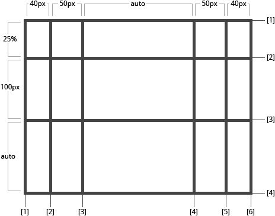

除了使用绝对单位，也可以使用百分比

```css
.container {
  display: grid;
  grid-template-columns: 25% 25% 25% 25%;
  grid-template-rows: 25% 25% 25% 25%;
}
```

#### (1) ` repeat() `

如果你的定义中包含重复的部分，则可以使用` repeat() ` 符号来简化写法：

```css
.container {
  grid-template-columns: repeat(3, 20px [col-start]) 5%;
}
```

上面的写法和下面等价：

```css
.container {
  grid-template-columns: 20px [col-start] 20px [col-start] 20px [col-start] 5%;
}
```

#### (2) ` auto-fill `

有时，单元格的大小是固定的，但是容器的大小不确定。如果希望每一行（或每一列）容纳尽可能多的单元格，这时可以使用` auto-fill `关键字表示自动填充。

```css
.container {
  display: grid;
  grid-template-columns: repeat(auto-fill, 100px);
}
```


#### (3) ` fr `

为了方便表示比例关系，网格布局提供了` fr `关键字（` fraction `的缩写，意为"片段"）。

“` fr `”单位允许将项目大小设置为网格容器自由空间的一部分。

如果两列的宽度分别为` 1fr `和` 2fr `，就表示后者是前者的` 2 `倍。

```css
.container {
  grid-template-columns: 1fr 2fr 1fr;
}
```

自由空间是在排除所有不可伸缩的**单元格**之后计算得到的。 在下面的示例中，` fr `单位可用的自由空间总量不包括` 50px `:

```css
.container {
  grid-template-columns: 1fr 50px 1fr 1fr;
}
```

#### (4) ` minmax() `

` minmax() `接受` 2 `个参数，最小值和最大值长度范围，该列/行的大小会根据剩余空间进行自动分配，大小在长度范围内。

```css
.container {
  grid-template-columns:150px 1fr 1fr minmax(50px, 150px);
}
```

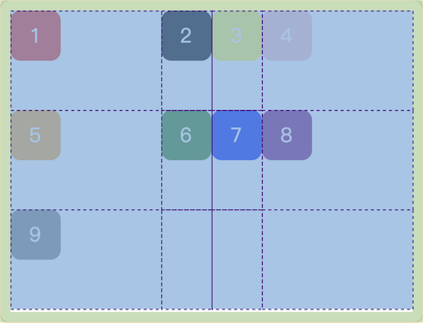

#### (5) ` auto `

` auto `关键字表示由浏览器自己决定长度。

```css
.container {
  grid-template-columns: 100px auto 100px;
}
```

上面代码中，第二列的宽度，基本上等于该列单元格的最大宽度，除非单元格内容设置了` min-width `，且这个值大于最大宽度。

#### (6) 网格线的名称

` grid-template-columns `属性和` grid-template-rows `属性里面，还可以使用方括号，指定每一根网格线的名字，方便以后的引用

```css
.container {
  grid-template-columns: [first] 40px [line2] 50px [line3] auto [col4-start] 50px [five] 40px [end];
  grid-template-rows: [row1-start] 25% [row1-end] 100px [third-line] auto [last-line];
}
```


需要注意的是，一个网格线可以有不止一个名字。例如，这里第` 2 `条网格线有两个名字：` row1-end `和` row2-start `：

```css
.container {
  grid-template-rows: [row1-start] 25% [row1-end row2-start] 25% [row2-end];
}
```

### ` 3.3 ` ` grid-template-areas `

网格布局允许指定"区域"（` area `），一个区域由单个或多个单元格组成。` grid-template-areas `属性用于定义区域。

通过引用` grid-area `属性指定的网格区域的名称。 重复网格区域的名称导致内容扩展到这些单元格。 点号表示一个空单元格。 语法本身提供了网格结构的可视化。

```css
.item-a {
  grid-area: header;
}
.item-b {
  grid-area: main;
}
.item-c {
  grid-area: sidebar;
}
.item-d {
  grid-area: footer;
}

.container {
  grid-template-columns: 50px 50px 50px 50px;
  grid-template-rows: auto;
  grid-template-areas:
    "header header header header"
    "main main . sidebar"
    "footer footer footer footer";
}
```

这将创建一个四列宽三行高的网格。 整个第一行将由` header ` 区域组成。 中间一行将由两个` main `区域、一个空单元格和一个 ` sidebar `区域组成。 最后一行是` footer `区域组成。

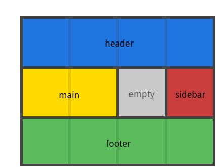

注意，区域的命名会影响到网格线。每个区域的起始网格线，会自动命名为**区域名-start**，终止网格线自动命名为**区域名-end**。

比如，区域名为` header `，则起始位置的水平网格线和垂直网格线叫做` header-start `，终止位置的水平网格线和垂直网格线叫做` header-end `。


### ` 3.4 ` `grid-column-gap / grid-row-gap / grid-gap`

` grid-row-gap `属性设置行与行的间隔（行间距），` grid-column-gap `属性设置列与列的间隔（列间距），
` grid-gap `是` grid-row-gap `和` grid-column-gap `的缩写。

这` 3 `个属性最新标准也可不写前缀，写为：` row-gap `、` column-gap `、` gap `。

```css
.container {
  grid-column-gap: <line-size>;
  grid-row-gap: <line-size>;
  grid-gap: <grid-row-gap> <grid-column-gap>;
}
```
- ` line-size `:  一个长度值

举例：
```css
.container {
  grid-column-gap: 10px;
  grid-row-gap: 15px;
  // 等价于
  column-gap: 10px;
  row-gap: 15px;
}
```

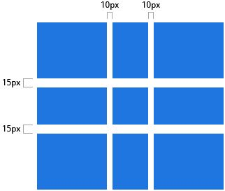

```css
.container {
  grid-gap: 10px 15px;
}
```

如果没有指定` grid-row-gap `，则会被设置为与` grid-column-gap  `相同的值。

只能在列或行之间创建缝隙，而不是在外部边缘创建。

### `3.5` `grid-auto-flow`

划分网格以后，**项目**会按照顺序，自动放置在每一个网格。默认的放置顺序是"**先行后列**"，即先填满第一行，再开始放入第二行。

```css
.container {
  grid-auto-flow: row | column | row dense | column dense
}
```

需要注意的是，` dense `可能导致您的` grid item `乱序。

**grid-auto-flow**决定放置顺序，默认值是` row `，即"先行后列"


也可以将它设成` column `，变成"先列后行"。

```css
.container {
  grid-auto-flow: column;
}
```


` grid-auto-flow `属性除了设置成` row `和` column `，还可以设成` row dense `和` column dense `。这两个值主要用于，某些项目指定位置以后，剩下的项目怎么自动放置。

下面的例子让` 1 `号项目和` 2 `号项目各占据两个单元格，然后在默认的` grid-auto-flow: row `情况下，会产生下面这样的布局。

```css
.container{
  display: grid;
  grid-auto-flow: row;
}

.item-1 {
  grid-column-start: 1;
  grid-column-end: 3;
}

.item-2 {
  grid-column-start: 1;
  grid-column-end: 3;
}
```


现在修改设置，设为` row dense `，表示"先行后列"，并且尽可能紧密填满，尽量不出现空格。

```css
.container{
  display: grid;
  grid-auto-flow: row dense;
}
```


上图会先填满第一行，再填满第二行，所以` 3 `号项目就会紧跟在` 1 `号项目的后面。` 8 `号项目和` 9 `号项目就会排到第四行。

```css
.container{
  display: grid;
  grid-auto-flow: column dense;
}
```


上图会先填满第一列，再填满第` 2 `列，所以` 3 `号项目在第一列，` 4 `号项目在第二列。` 8 `号项目和` 9 `号项目被挤到了第四列。

### `3.6` `justify-items / align-items / place-items`

` justify-items `属性设置单元格内容的水平位置，` align-items `属性设置单元格内容的垂直位置。

```css
.container {
  justify-items: start | end | center | stretch;
  align-items: start | end | center | stretch;
}
```

它们的属性值为：

- ` start `: 内容与网格区域的左端对齐
- ` end `: 内容与网格区域的右端对齐
- ` center `: 内容位于网格区域的中间位置
- ` stretch `: 内容宽度占据整个网格区域空间(这是默认值)


```css
.container {
  justify-items: start;
}
```


```css
.container{
  justify-items: end;
}
```

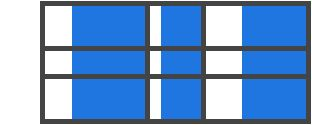

```css
.container {
  justify-items: center;
}
```

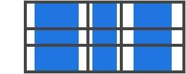

```css
.container {
  justify-items: stretch;
}
```

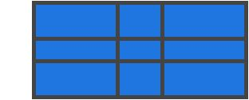

也可以通过给单个**项目**设置` justify-self `属性来达到上述效果。

```css
.container {
  align-items: start;
}
```


```css
.container {
  align-items: end;
}
```


```css
.container {
  align-items: center;
}
```


```css
.container {
  align-items: stretch;
}
```


也可以通过给单个**项目**设置` align-self `属性来达到上述效果。

` place-items `属性是` align-items `属性和` justify-items `属性的合并简写形式。

```css
.container {
  place-items: <align-items> <justify-items>;
}
```
```css
.container {
  place-items: start end;
}
```
如果省略第二个值，则浏览器认为与第一个值相等。

### ` 3.7 ` `justify-content / align-content / place-content`

` justify-content `属性是整个内容区域在容器里面的水平位置（左中右），` align-content `属性是整个内容区域的垂直位置（上中下）。

```css
.container {
  justify-content: start | end | center | stretch | space-around | space-between | space-evenly;
  align-content: start | end | center | stretch | space-around | space-between | space-evenly;
}
```

它们的属性值可以为：

- ` start ` – 与网格容器的左边对齐
- ` end ` – 与网格容器的右边对齐
- ` center ` – 与网格容器的中间对齐
- ` stretch ` – 调整单元格的大小，让宽度填充整个网格容器
- ` space-around ` – 在单元格之间设置均等宽度的空白间隙，其外边缘间隙大小为中间空白间隙宽度的一半
- ` space-between ` – 在单元格之间设置均等宽度空白间隙，其外边缘无间隙
- ` space-evenly` – 在每个单元格之间设置均等宽度的空白间隙，包括外边缘

```css
.container {
  justify-content: start;
}
```


```css
.container {
  justify-content: end;
}
```


```css
.container {
  justify-content: center;
}
```


```css
.container {
  justify-content: stretch;
}
```


```css
.container {
  justify-content: space-around;
}
```


```css
.container {
  justify-content: space-between;
}
```


```css
.container {
  justify-content: space-evenly;
}
```


```css
.container {
  align-content: start;
}
```

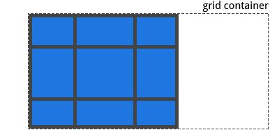

```css
.container {
  align-content: end;
}
```


```css
.container {
  align-content: center;
}
```

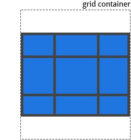

```css
.container {
  align-content: stretch;
}
```


```css
.container {
  align-content: space-around;
}
```
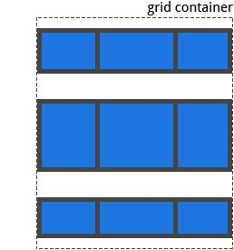

```css
.container {
  align-content: space-between;
}
```


```css
.container {
  align-content: spaace-evently;
}
```


` place-content `属性是` align-content `属性和` justify-content `属性的合并简写形式。

```css
.container {
  place-content: <align-content> <justify-content>;
}
```
```css
.container {
  place-content: space-around space-evenly;
}
```
如果省略第二个值，则浏览器认为与第一个值相等。

### `3.8` `grid-auto-columns / grid-auto-rows`

有时候，一些项目的指定位置，在现有网格的外部。比如网格只有3列，但是某一个项目指定在第` 5 `行。这时，浏览器会自动生成多余的网格，以便放置项目。

` grid-auto-columns `属性和` grid-auto-rows `属性用来设置，浏览器自动创建的多余网格的列宽和行高。它们的写法与` grid-template-columns `和` grid-template-rows `完全相同。如果不指定这两个属性，浏览器完全根据单元格内容的大小，决定新增网格的列宽和行高。

下面的例子里面，划分好的网格是` 3 `行 和` 3 `列，但是，` 8 `号项目指定在第` 4 `行，` 9 `号项目指定在第` 5 `行。

```css
.container {
  display: grid;
  grid-template-columns: 100px 100px 100px;
  grid-template-rows: 100px 100px 100px;
  grid-auto-rows: 50px;
}
```
上面代码指定新增的行高统一为`50px `（原始的行高为` 100px `）。


### ` 3.9 ` `grid-template / grid `

` grid-template `属性是` grid-template-columns `、` grid-template-rows `和` grid-template-areas `这三个属性的合并简写形式。

` grid `属性是` grid-template-rows `、` grid-template-columns `、` grid-template-areas `、 ` grid-auto-rows `、` grid-auto-columns `、` grid-auto-flow `这六个属性的合并简写形式。

##  四、项目属性

### ` 4.1 ` ` grid-column-start / grid-column-end / grid-row-start /grid-row-end `

项目的位置是可以指定的：

` grid-column-start / grid-row-start `属性表示**项目**的网格线的起始位置，` grid-column-end / grid-row-end `属性表示**项目**的网格线的终止位置。

值：

- ` <line> `:  可以是一个数字来指代相应编号的网格线，也可使用名称指代相应命名的网格线
- ` span <number> `: 项目将跨越指定数量的网格轨道
- ` span <name> `: 项目将跨越一些轨道，直到碰到指定命名的网格线
- ` auto `: 自动布局， 或者自动跨越， 或者跨越一个默认的轨道

```css
.item {
  grid-column-start: <number> | <name> | span <number> | span <name> | auto
  grid-column-end: <number> | <name> | span <number> | span <name> | auto
  grid-row-start: <number> | <name> | span <number> | span <name> | auto
  grid-row-end: <number> | <name> | span <number> | span <name> | auto
}
```
举例：

```css
.item-a {
  grid-column-start: 2;
  grid-column-end: five;
  grid-row-start: row1-start
  grid-row-end: 3
}
```


```css
.item-b {
  grid-column-start: 1;
  grid-column-end: span col4-start;
  grid-row-start: 2
  grid-row-end: span 2
}
```


如果没有声明` grid-column-end / grid-row-end `，默认情况下，该网格项将跨越` 1 `个轨道。

网格项可以相互重叠。 您可以使用` z-index `来控制它们的堆叠顺序。

### ` 4.2 ` `grid-column / grid-row `

` grid-column-start + grid-column-end `, 和` grid-row-start + grid-row-end `的简写形式。

值：

- ` <start-line> / <end-line> `– 每个值的用法都和属性分开写时的用法一样

```css
.item {
  grid-column: <start-line> / <end-line> | <start-line> / span <value>;
  grid-row: <start-line> / <end-line> | <start-line> / span <value>;
}
```

举例：

```css
.item-c {
  grid-column: 3 / span 2;
  grid-row: third-line / 4;
}
```


如果没有指定结束行值，则该网格项默认跨越` 1 `个轨道。

### ` 4.3 ` ` grid-area `

给` grid item `进行命名以便于使用` grid-template-areas ` 属性创建模板时来进行引用。另外也可以做为` grid-row-start + grid-column-start + grid-row-end + grid-column-end ` 的简写形式。

值：

- ` <name> `– 你的命名
- ` <row-start> / <column-start> / <row-end> / <column-end> ` – 可以是数字，也可以是网格线的名字

```css
.item {
  grid-area: <name> | <row-start> / <column-start> / <row-end> / <column-end>;
}
```

举例:

给一个网格项命名

```css
.item-d {
  grid-area: header
}
```

作为` grid-row-start + grid-column-start + grid-row-end + grid-column-end `的简写:

```css
.item-d {
  grid-area: 1 / col4-start / last-line / 6
}
```

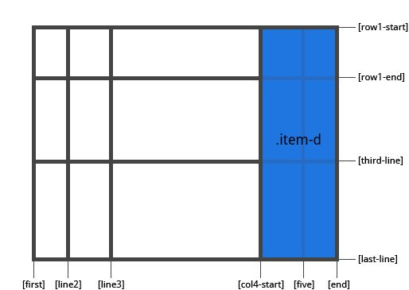

### `4.4 ` ` justify-self / align-self / place-self`

` justify-self `属性设置单元格内容的水平位置，跟` justify-items `属性的用法完全一致，但只作用于单个项目。

` align-self `属性设置单元格内容的垂直位置，跟` align-items `属性的用法完全一致，也是只作用于单个项目。

```css
.item {
  justify-self: start | end | center | stretch;
  align-self: start | end | center | stretch;
}
```

值：

- ` start ` – 将内容对齐到单元格的左端
- ` end `– 将内容对齐到单元格的右端
- ` center `– 将内容对齐到单元格的中间
- ` stretch `– 填充单元格的宽度 (这是默认值)
举例：

```css
.item-a {
  justify-self: start;
}
```


```css
.item-a {
  justify-self: end;
}
```


```css
.item-a {
  justify-self: center;
}
```


```css
.item-a {
  justify-self: stretch;
}
```


```css
.item-a {
  align-self: start;
}
```


```css
.item-a {
  align-self: end;
}
```


```css
.item-a {
  align-self: center;
}
```


```css
.item-a {
  align-self: stretch;
}
```


` place-self `属性是` align-self `属性和` justify-self `属性的合并简写形式。

```css
.container {
  place-self: <align-self> <justify-self>;
}
```
下面是一个例子。

```css
.container {
  place-self: center center;
}
```
如果省略第二个值，` place-self `属性会认为这两个值相等。

## 参考文献

[CSS Grid 网格布局教程](http://www.ruanyifeng.com/blog/2019/03/grid-layout-tutorial.html)

[CSS网格布局学习指南](https://zhuanlan.zhihu.com/p/33030746)
