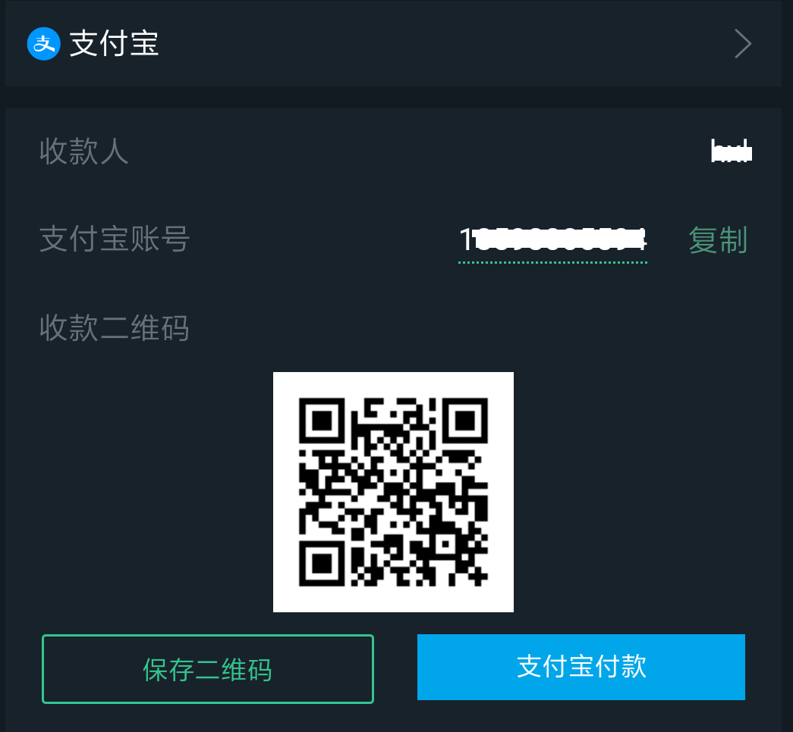
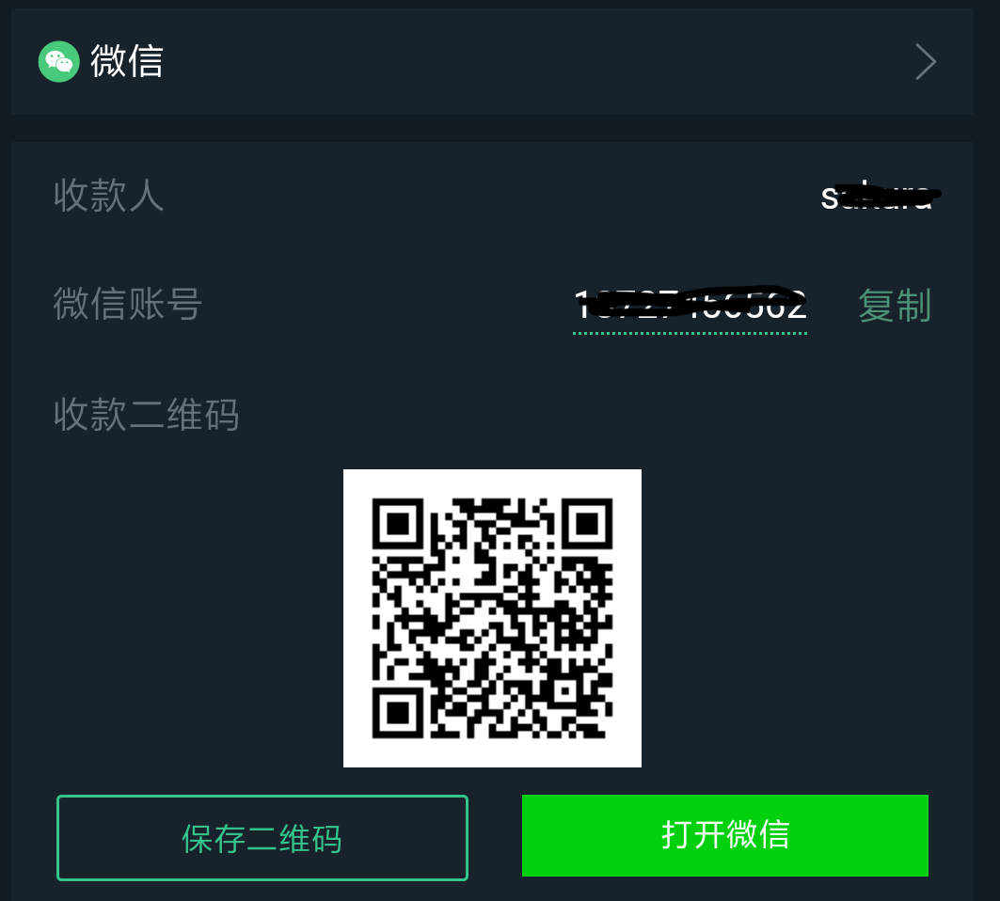
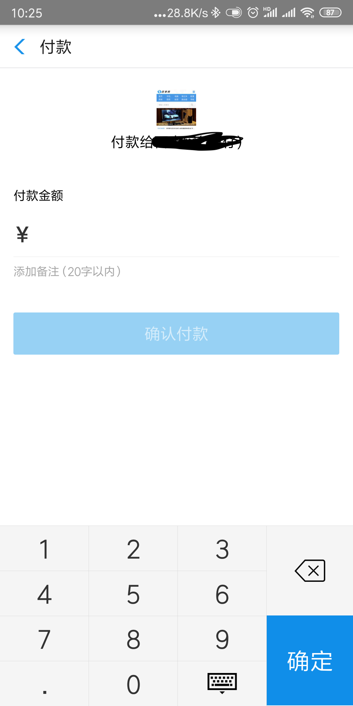
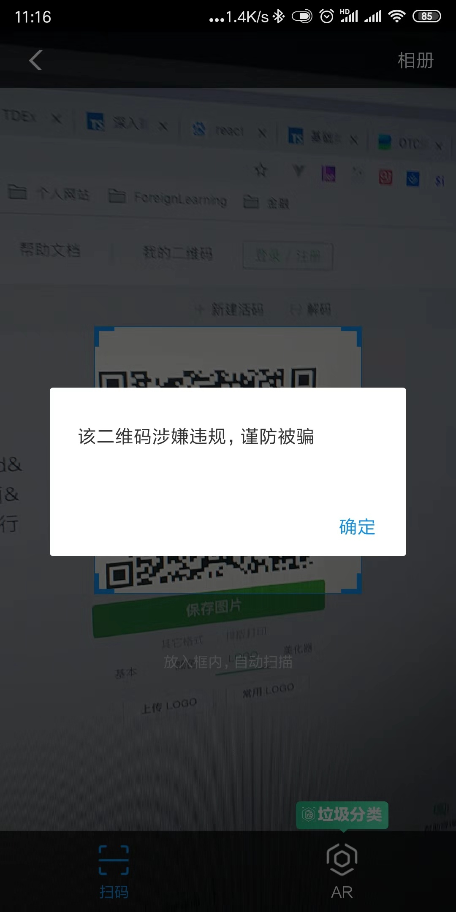
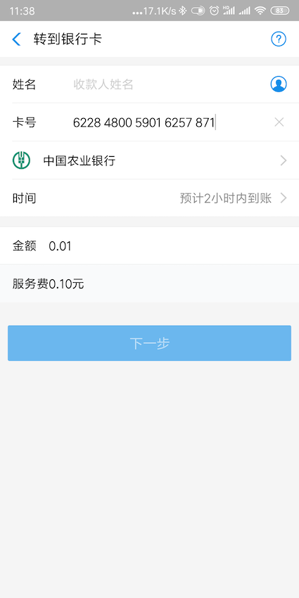

# 移动端中跳转支付宝、微信

今儿在` APP `和` H5 `中遇到付款的场景：
1. 首先用户` B `成为商家，要卖“衣服”，并且提供了收款方式，比如银行卡、微信和支付宝
2. 用户` A `看见商家B的衣服后，下单要买“衣服”
3. 下单后，用户` A `根据用户` B `提供的银行卡、微信和支付宝账号进行转账。

具体的交互就是：

1. 选择银行卡时，用户` A `除了可以使用银行` APP `或者银行网站转账，也可以跳转支付宝给银行卡转账，如图：


2. 选择支付宝时，可以保存收款二维码，也可以直接转账给支付宝账户



3. 选择微信时，先保存收款二维码，再打开微信



这里都是在` APP `中通过点击实现和支付宝和微信的交互，下面让我们用` a `标签来实现这个需求

### 1. 选择支付宝，转账给支付宝账户

这个就比较简单了：

```html
<a
  style="background: #01a6ea"
  href="alipays://platformapi/startapp?appId=20000067&url=HTTPS://QR.ALIPAY.COM/XXXXXXXX"
>支付宝付款</a>
```

参数：

```
appId==20000067   // 应用ID - 默认
url=HTTPS://QR.ALIPAY.COM/XXXXXXXX    // 支付宝收款二维码地址
```

当点击` a `标签时，就会跳到支付宝的转账页面：



### 2. 选择银行卡，打开支付宝转账给银行卡

这个就稍微难点，我尝试了两种方法：

#### 第一种方式

使用下面的链接：

```
alipays://platformapi/startapp?appId=09999988&actionType=toCard&sourceId=bill&cardNo=6228480059016257871&bankAccount=xxx&money=0.01&amount=0.01&bankMark=ABC&bankName=xxx
```

参数：

```
appId=09999988   // 应用ID - 默认
actionType=toCard // 转账类型 toCard - 到银行卡
sourceId=bill // ？
cardNo=6228480059016257871 // 银行卡号
bankAccount=xxx // 银行账户
money=0.01 // 转账金额
amount=0.01 // 转账额度
bankMark= ABC // 银行代号
bankName=xxx // 银行名称
```

上面的链接，可以作为` a `标签` href `的属性值或生成二维码：


但是呢，无论是作为` a `标签的` href `属性值还是生成二维码扫描，都会被支付宝拦截：



后来发现去掉参数` bankAccount `就不会有警告了：

```
alipays://platformapi/startapp?appId=09999988&actionType=toCard&sourceId=bill&cardNo=6228480059016257871&money=0.01&amount=0.01&bankMark=ABC&bankName=xxx
```

生成二维码如下：


如果直接扫描这个二维码是没问题的：



但是下面两种情况还是不可行的：
1. 作为` a `标签的` href `属性值
2. 保存二维码到相册，通过支付宝扫一扫，从相册选择图片(支付宝-相册，在相册中找不到这张图片，但是从本地相册中是可以看到这张图片的~ _ ~)

也就是说在移动端打开支付宝转账到银行卡使用下面的链接：

```
alipays://platformapi/startapp?appId=09999988&actionType=toCard&sourceId=bill&cardNo=6228480059016257871&money=0.01&amount=0.01&bankMark=ABC&bankName=xxx
```

就只能通过直接扫二维码才有用，不能直接使用` a `标签，而且这也不符合我们的场景。

#### 第二种方式

第二种方式其实是受第一种方式的启发，第一种方式是在扫描二维码的情况下可行，那我们让支付宝识别这个二维码就可以啦

第二种方式分三步走：

第一步：设置二维码内容

这一步其实就是第一种方式：

```js
const qrcode = 'alipays://platformapi/startapp?appId=09999988&actionType=toCard&sourceId=bill&cardNo=6228480059016257871&money=0.01&amount=0.01&bankMark=ABC&bankName=xxx'
```

第二步：获得二维码地址

将` qrcode `生成二维码，并上传到服务器，获得到图片的地址，比如:

```js
const url = 'http://image.baidu.com/qrcode.jpg'
```

第三步：使用` a `标签

```html
<a
  style="background: #01a6ea"
  href="alipays://platformapi/startapp?saId=10000007&clientVersion=3.7.0.0718&qrcode=url"
>打开支付宝转账</a>
```

参数` qrcode=url `中的` url `就是第二步中的生成的` url `

结果如图：


最后一个打开微信就简单了

### 3. 打开微信

```html
<a href="weixin://" style="background: #01d00e">打开微信</a>
```


### 4. 总结

1. 转给支付宝账户

```html
<a
  style="background: #01a6ea"
  href="alipays://platformapi/startapp?appId=20000067&url=HTTPS://QR.ALIPAY.COM/XXXXXXXX"
>支付宝付款</a>
```

2. 支付宝转账给银行卡
- 第一步：设置二维码内容

```js
const qrcode = 'alipays://platformapi/startapp?appId=09999988&actionType=toCard&sourceId=bill&cardNo=6228480059016257871&money=0.01&amount=0.01&bankMark=ABC&bankName=xxx'
```

- 第二步：获得二维码地址

将` qrcode `生成二维码，并上传到服务器，获得到图片的地址，比如:

```js
const url = 'http://image.baidu.com/qrcode.jpg'
```

- 第三步：使用` a `标签

```html
<a
  style="background: #01a6ea"
  href="alipays://platformapi/startapp?saId=10000007&clientVersion=3.7.0.0718&qrcode=url"
>打开支付宝转账</a>
```
3. 打开微信

```html
<a href="weixin://" style="background: #01d00e">打开微信</a>
```
