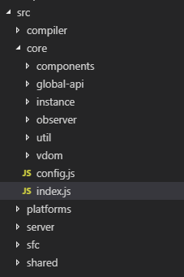
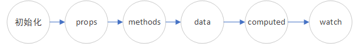

# Vue源码解读（一）：响应式数据

> 此文章是基于 Vue 2 版本

先看个例子：

```js
var vm = new Vue({
  props: {
    rootProp: Boolean
  },
  data {
    a: '',
    b: ''
  },
  computed: {
    rootCompute () {
      return ''
    }
  },
  watch: {
    rootWatcher (newVal, oldVal) {}
  },
  method: {}
})
```

在上面的代码中，我们创建了一个` Vue `实例，并且我们给了它一个**选项对象**来进行初始化。

下面我们将根据` Vue `源码来说明` Vue `是如何实现响应式的。

### ` Vue `项目结构

在` github `上将` Vue `的源码` clone `到本地，我们可以看到，` Vue `的源码目录结构主要如下：



### ` Vue `入口文件

` Vue `在入口文件是` src/core/index.js `，其中简化的代码如下：

```js
// src/core/index.js
import Vue from './instance/index'
// ...
export default Vue
```

从代码中，我们可以发现，在这个文件中，我们导出了一个` Vue `实例。那么初始化` Vue `实例则是在` src/core/instance/index.js `文件中完成的。

### ` Vue `实例的初始化

` Vue `实例的初始化包括一系列的数据初始化,它的目录结构如下：


来到` index.js `中
```js
// src/core/instance/index.js
import { initMixin } from './init'
function Vue (options) {
  // ...
  this._init(options)
}
initMixin(Vue)
// ...
export default Vue
```

从代码中，我们可以看出` Vue `是一个构造函数，创建` Vue `实例时，我们会执行` _init `函数，那么 ` _init `函数到底做了什么？又定义在哪呢？在说`  _init `函数之前，我们先来看看` initMixin `函数。

` initMixin `函数是在创建实例之前就执行多的，我们来看看` initMixin `函数。

```js
// src/core/instance/init.js
import { initState } from './state'

export function initMixin (Vue: Class<Component>) {
  Vue.prototype._init = function (options?: Object) {
    const vm: Component = this
    initLifecycle(vm) // vm 生命周期相关变量初始化操作
    initEvents(vm)    // vm 事件相关初始化
    initRender(vm)    // 模板解析相关初始化
    callHook(vm, 'beforeCreate') // 调用 beforeCreate 钩子函数
    initInjections(vm) // resolve injections before data/props
    initState(vm)  // vm 状态初始化
    initProvide(vm) // resolve provide after data/props
    callHook(vm, 'created') // 调用 created 钩子函数
  }
}
```

从这里我们可以看出，` Vue `构造函数中的` _init `函数在这里有定义， 所以运行` new Vue() `时， ` _init `函数就会进行一系列的初始化，包括` Vue `实例的生命周期，事件、数据等

我们的重点在` initState(vm) `，里面实现了` props `, ` methods `,` data `,` computed `,` watch `的初始化操作。我们来看看源码

```js
// src/core/instance/state.js
import Watcher from '../observer/watcher'
import { pushTarget, popTarget } from '../observer/dep'

import { observe } from '../observer/index'

export function initState (vm: Component) {
  vm._watchers = []
  const opts = vm.$options
  if (opts.props) initProps(vm, opts.props)
  if (opts.methods) initMethods(vm, opts.methods)
  if (opts.data) {
    initData(vm)
  } else {
    observe(vm._data = {}, true /* asRootData */)
  }
  if (opts.computed) initComputed(vm, opts.computed)
  if (opts.watch && opts.watch !== nativeWatch) {
    initWatch(vm, opts.watch)
  }
}
```

代码中的` vm.$options `就是**选项对象**，它也是在` _init `函数中赋值的。

根据代码，我们也可以得到选项对象初始化的顺序：




我们先来说说` data `的初始化

### 初始化` Data `

熟悉` Vue `的朋友都知道，在` Vue `组件中，` data `被要求是一个函数，所以对于` data `的初始化是执行` initData(vm) `函数。

```js
// src/core/instance/state.js
import { observe } from '../observer/index'
function initData(vm: Component) {
  //...
  observe(data, true /* asRootData */)
}
```
代码中` observe `是在其他地方定义的，它的参数` data `是组件中` data `函数的返回值，比如上面的例子，此时参数` data `就是对象` { a: '', b: '' } `

那我们接着来看` observe `函数

#### ` Observer `（观察者）

```js
// src/core/observe/index.js
export function observe (value: any, asRootData: ?boolean): Observer | void {
  let ob: Observer | void
  ob = new Observer(value)
  return ob
}
```

其中，` observe `实例化了` Observer `对象，参数为对象` { a: '', b: '' } `。

现在我们来看看` Observer `做了什么

```js
// src/core/observe/index.js
import Dep from './dep'

export class Observer {
  value: any;
  dep: Dep;
  vmCount: number; // number of vms that have this object as root $data
  constructor (value: any) {
    this.value = value
    this.dep = new Dep()
    this.vmCount = 0
    if (Array.isArray(value)) {
      // ...
    } else {
      this.walk(value)
    }
  }
  // 遍历对象，通过 defineProperty 函数实现双向绑定
  walk (obj: Object) {
    const keys = Object.keys(obj)
    for (let i = 0; i < keys.length; i++) {
      defineReactive(obj, keys[i])
    }
  }
  // ...
}
```

类` Observer `在初始化时保存了传进来的` data `，并且实例化了一个` Dep `。

当` data `为对象时，调用了` walk `函数， 遍历了对象的每个属性，并且调用了` defineReactive `函数，对每个属性实现双向绑定。

下面我们来看看` defineReactive `的具体实现

```js
// Define a reactive property on an Object.
export function defineReactive (
  obj: Object,
  key: string,
  val: any,
  customSetter?: ?Function,
  shallow?: boolean
) {
  const dep = new Dep()

  const property = Object.getOwnPropertyDescriptor(obj, key)

  const getter = property && property.get
  const setter = property && property.set
  if ((!getter || setter) && arguments.length === 2) {
    val = obj[key]
  }
  let childOb = !shallow && observe(val)
  Object.defineProperty(obj, key, {
    enumerable: true,
    configurable: true,
    // 拦截 getter，当取值时会触发该函数
    get: function reactiveGetter () {
      const value = getter ? getter.call(obj) : val
      if (Dep.target) {
        dep.depend()
        // ...
      }
      return value
    },
    // 拦截 setter，当赋值时会触发该函数
    set: function reactiveSetter (newVal) {
      const value = getter ? getter.call(obj) : val
      // ...
      if (getter && !setter) return
      if (setter) {
        setter.call(obj, newVal)
      } else {
        val = newVal
      }
      // ...
      dep.notify()
    }
  })
}
```

` defineReactive `函数利用了` Object.defineProperty() `对对象属性进行了重写，并且每个属性都有一个` Dep `实例

在` Object.defineProperty `中自定义` get `和` set `函数，并在` get `中进行依赖收集，在` set `中派发更新。

其中，` dep `是` Dep `的实例，那` Dep `到底是什么呢？

—— ` Dep `其实是一个订阅者的管理中心，管理着所有的订阅者

下面我们来看看` Dep `

### ` Dep `（订阅者管理中心）

给` data `属性添加订阅者有一个前提条件 —— ` Dep.target `存在，那` Dep.target `是什么呢？

我们来看` src/core/observe/dep.js `中关于` Dep `的代码：

```js
// src/core/observe/dep.js
export default class Dep {
  static target: ?Watcher;
  id: number;
  subs: Array<Watcher>;

  constructor () {
    this.id = uid++
    this.subs = []
  }
  // 添加观察者
  addSub (sub: Watcher) {
    this.subs.push(sub)
  }
  // 移除观察者
  removeSub (sub: Watcher) {
    remove(this.subs, sub)
  }

  depend () {
    if (Dep.target) {
      // 调用 Watcher 的 addDep 函数
      Dep.target.addDep(this)
    }
  }
  // 派发更新
  notify () {
    // stabilize the subscriber list first
    const subs = this.subs.slice()
    // ...
    for (let i = 0, l = subs.length; i < l; i++) {
      subs[i].update()
    }
  }
}

Dep.target = null
const targetStack = []

export function pushTarget (target: ?Watcher) {
  targetStack.push(target)
  Dep.target = target
}
```

从代码中，我们可以发现:
1. 在` Dep `中分别定义了` get `和` set `中需要用的` depend `和` notify `函数，并且可以发现` depend `是添加一个订阅者，` notify `是用来更新订阅者的
2. ` Dep `通过静态属性` target `来控制在同一时间内只有一个观察者，并且通过` pushTarget `来给` target `属性赋值。
3. ` Dep `中方法主要是对` Watcher `队列进行增加、移除，所以` Dep `其实是` Watcher `管理中心，管理着所有的` Watcher `。

下面我们来看看` Watcher `：

### ` Watcher `（订阅者）

```js
// src/core/observe/watcher.js
import Dep, { pushTarget, popTarget } from './dep'

export default class Watcher {
  // ...
  id: number
  constructor (options) {
  // ...
    this.id = ++uid
  }
  addDep (dep: Dep) {
    const id = dep.id
    if (!this.newDepIds.has(id)) {
      this.newDepIds.add(id)
      this.newDeps.push(dep)
      if (!this.depIds.has(id)) {
        dep.addSub(this)
      }
    }
  }

  update () {
    /* istanbul ignore else */
    if (this.lazy) {
      this.dirty = true
    } else if (this.sync) {
      this.run()
    } else {
      // 一般会进入这里
      queueWatcher(this)
    }
  }
}
```

```js
// src/core/observe/scheduler.js
let flushing = false
export function queueWatcher (watcher: Watcher) {
  const id = watcher.id
  // 判断 Watcher 是否 push 过
  // 因为存在改变了多个数据，多个数据的 Watch 是同一个
  if (has[id] == null) {
    has[id] = true
    if (!flushing) {
      // 最初会进入这个条件
      queue.push(watcher)
    } else {
      // 在执行 flushSchedulerQueue 函数时，如果有新的派发更新会进入这里
      // 插入新的 watcher
      let i = queue.length - 1
      while (i > index && queue[i].id > watcher.id) {
        i--
      }
      queue.splice(i + 1, 0, watcher)
    }
    // 最初会进入这个条件
    if (!waiting) {
      waiting = true

      if (process.env.NODE_ENV !== 'production' && !config.async) {
        flushSchedulerQueue()
        return
      }
      // 将所有 Watcher 统一放入 nextTick 调用
      // 因为每次派发更新都会引发渲染
      nextTick(flushSchedulerQueue)
    }
  }
}

function flushSchedulerQueue () {
  currentFlushTimestamp = getNow()
  flushing = true
  let watcher, id

  // 根据 id 排序 watch，确保：
  // 1. 组件更新从父到子
  // 2. 用户写的 Watch 先于渲染 Watch
  // 3. 如果在父组件 watch run 的时候有组件销毁了，这个 Watch 可以被跳过
  queue.sort((a, b) => a.id - b.id)

  // 不缓存队列长度，因为在遍历的过程中可能队列的长度发生变化
  for (index = 0; index < queue.length; index++) {
    watcher = queue[index]
    if (watcher.before) {
      // 执行 beforeUpdate 钩子函数
      watcher.before()
    }
    id = watcher.id
    has[id] = null
    // 在这里执行用户写的 Watch 的回调函数并且渲染组件
    watcher.run()
    // 判断无限循环
    // 比如在 watch 中又重新给对象赋值了，就会出现这个情况
    if (process.env.NODE_ENV !== 'production' && has[id] != null) {
      circular[id] = (circular[id] || 0) + 1
      if (circular[id] > MAX_UPDATE_COUNT) {
        // ...
        break
      }
    }
  }
```

在派发更新的全过程中，核心流程就是给对象赋值，触发` set `中的派发更新函数。将所有` Watcher `都放入` nextTick `中进行更新，` nextTick `回调中执行用户` Watch `的回调函数并且渲染组件。

### 总结

1. ` Vue `中数据响应原理主要涉及到下面几个类


下图是类中的一些属性和方法


2. 下图是几个类的关联


- 图中的红色箭头是` Watcher `的实例化。在实例化的过程中，会调用方法` get `来设置` Dep.target `为当前` Watcher `实例，并且触发观察对象的` getter `方法，进行依赖收集。
- 图中的蓝色箭头是依赖收集的过程。观察对象的` getter `方法被触发，经过` dep.depend() `、` Dep.target.addDep() `和` dep.addSub() `等方法，会将当前观察对象的` dep `实例添加到` Watcher ` 实例的` deps `中，并且将当前` Watcher `实例添加到` Dep `的属性` subs `中进行统一管理。
- 图中的黄色箭头是派发更新过程。当观察对象改变后，会调用` dep.notify() `方法，触发` subs `中当前的` watcher1 `实例的` update `方法，最后会重新渲染。
