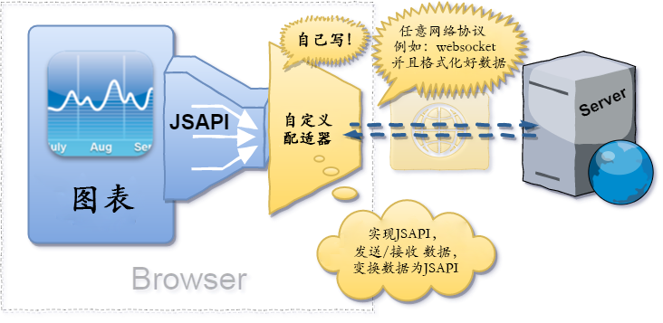

# TradingView 入门

TradingView 是一种主要服务于交易技术分析金融图表，拥有丰富的技术指标库，常常用在金融交易所中 k 线的绘制。

## 一、连接数据

**图表库不包含市场数据**，我们使用它时必须提供所需格式的数据。图表可用用两种方式接收数据：

- 使用推模型技术实时更新，例如通过 WebSocket。这样图表就会实时更新。为了达到这个目的，必须使用JavaScript API并且准备好自己的传输方法。
- 使用拉模型/脉冲(pulse)刷新为基础进行更新，其中图表数据每 x 秒更新一次，或者被用户手动重新加载。为此，需要使用 UDF协议 并编写自己的 datafeed 包装类

### UDF 场景


### JavaScript API 场景



## 二、JavaScript API

官网介绍 JavaScript API：
> 这是啥？一套JS方法(以实现指定的公共接口)
> 我该怎么使用它？你应该创建一个 JS 对象，它将以某种方式接收数据，并响应图表库的请求。

表示~~~~~

### Methods

1. [onReady](#onready-callback)
2. [searchSymbols](#searchsymbols)
3. [resolveSymbol](#resolvesymbol)
4. [getBars](#getbars)
5. [subscribeBars](#subscribebars)
6. [unsubscribeBars](#unsubscribebars)
7. [calculateHistoryDepth](#calculatehistorydepth)
8. [getMarks](#getmarks)
9. [getTimescaleMarks](#gettimescalemarks)
10. [getServerTime](#getservertime-callback)

### [交易终端专属](#交易终端专属-2)

1. [getQuotes](#getquotes)
2. [subscribeQuotes](#subscribequotes)
3. [unsubscribeQuotes](#unsubscribequotes)
4. [subscribeDepth](#subscribedepth)
5. [unsubscribeDepth](#unsubscribedepth)

#### onReady(callback)

- **参数**:
  - { Function } callback
- **说明` callback `**：
  - 类型：Function
  - 参数：
    - { Object } configurationData
- **描述**：
  - onReady 方法用来设置图表配置，这些数据会影响到图表支持的功能。

```js
callback: function(configurationData) {
  // ...
}
```

其中 configurationData 为下面的结构：

```ts
interface configurationData = {
  exchanges: Array<{
    value: string,
    name: string,
    desc: string
  }>
  symbols_types: Array<{
    name: string,
    value: string
  }>
  supported_resolutions: Array<string | number>
  supports_marks: boolean
  supports_timescale_marks: boolean
  supports_time: boolean
  futures_regex: object
}
```

- exchanges

exchanges 是描述交易所对象的数组，其中 value 将被作为 exchange 参数传递给 [searchSymbols](#searchsymbols)

exchanges = [] 会导致商品查询列表中看不到交易所过滤器。 value = '' 来创建通配符筛选器。

- symbols_types

symbols_types 是描述商品类型对象的数组，其中 value 将被作为 symbolType 参数传递给 [searchSymbols](#searchsymbols)

symbols_types = [] 会导致商品查询列表中看不到交易所过滤器。 使用value = '' 来创建通配符筛选器。

- supported_resolutions

supported_resolutions 表示支持的周期数组。如果周期是一个数字，则表示分钟数，如果是字符串，则可以是"*D", "*W","_M"。

resolutions = undefined 或 resolutions = []时，周期拥有 widget 中的默认内容

- supports_marks

supports_marks 用来标识 datafeed 是否支持在 K 线上显示标记。

- supports_timescale_marks

supports_timescale_marks 用来标识 datafeed 是否支持时间刻度标记。

- supports_time

supports_time 用于在价格刻度上显示倒计时。将此设置为 true 假设 datafeed 提供服务器时间( unix 时间)

- futures_regex

设置 futures_regex 后，可以在商品搜索中对期货进行分组。

这个正则表达式会将期货商品分为两部分：合约种类，到期时间

实例 regex: : /^(.+)([12]!|[FGHJKMNQUVXZ]\d{1,2})$/. 它将应用于类型为 futures 的商品图表

#### searchSymbols

- 用法：
  - searchSymbols(userInput, exchange, symbolType, onResultReadyCallback)
- 参数：
  - { string } userInput: 用户在商品搜索框中输入的文字
  - { string | undefined } exchange: 用户选择搜索的交易所
  - { string | undefined } symbolType: 请求的商品类型: index、stock、forex等
  - { Function } onResultReadyCallback
    onResultReadyCallback = function(result) {}
- 说明：
  - searchSymbols 来用匹配用户搜索的商品列表。

#### resolveSymbol

- 用法：
  - resolveSymbol(symbolName, onSymbolResolvedCallback, onResolveErrorCallback)
- 参数：
  - { string } symbolName: 商品名称或 ticker
  - { Function } onSymbolResolvedCallback: 回调参数为 [SymbolInfo](#symbolinfo)
  - { Function } onResolveErrorCallback: 回调参数为 reason
- 说明：
  - resolveSymbol： 通过商品名称解析商品信息([SymbolInfo](#symbolinfo))

#### getBars

- 用法：
  - getBars(symbolInfo, resolution, from, to, onHistoryCallback, onErrorCallback, firstDataRequest)
- 参数：
  - { [SymbolInfo](#symbolinfo) } symbolInfo: 商品信息对象
  - { string } resolution: 周期
  - { number } from: unix 时间戳，最左边请求的 k 线时间
  - { number } to: unix 时间戳，最右边请求的 k 线时间
  - { Function } onHistoryCallback
    - onHistoryCallback = function (bars, meta) {}
    - bars: Bar 对象数组{ time, close, open, high, low, volume }
    - meta: object{ noData = true | false, nextTime = unix time}
  - onErrorCallback: function(reason)
  - { boolean } firstDataRequest
    - 标识是否第一次调用此商品/周期的历史记录。
  - 说明
    - 通过日期范围获取历史 k 线数据。

#### subscribeBars

  - 用法: subscribeBars(symbolInfo, resolution, onRealtimeCallback, subscribeUID, onResetCacheNeededCallback)
  - 参数：
    - { [SymbolInfo](#symbolinfo) } symbolInfo: 商品信息对象
    - { string } resolution: 周期
    - { Function } onRealtimeCallback
      - onRealtimeCallback = function(bar) {}
      - bar: object{ noData = true | false, nextTime = unix time}
    - { object } subscribeUID
    - { Function } onResetCacheNeededCallback: 将在 bars 数据变化时执行
  - 说明:
    订阅 K 线数据，图表库将调用 onRealtimeCallback 方法以更新实时数据

#### unsubscribeBars

- 用法: unsubscribeBars(subscribeUID)
- 参数：
  - { object } subscribeUID
- 说明:
  - 取消订阅 K 线数据

#### calculateHistoryDepth

- 用法: calculateHistoryDepth(resolution, resolutionBack, intervalBack)
- 参数：
  - { string } resolution: 请求商品的周期
  - { string } resolutionBack: 期望历史周期时刻。支持的值为 D | M
  - { number } intervalBack: 数量
- 说明:
  - 请求一些历史数据时调用 calculateHistoryDepth 方法，让我们能够覆盖所需的历史深度。

例子：

- calculateHistoryDepth('D', 'M', 12): 请求 12 个月的日线数据
- calculateHistoryDepth(60, 'D', 15): 请求 15 天的 60 分钟数据

#### getMarks

- 用法: getMarks(symbolInfo, startDate, endDate, onDataCallBack, resolution)
- 参数：
  - { [SymbolInfo](#symbolinfo) } symbolInfo: 请求商品的周期
  - { number } startDate: unix 时间戳，最左边请求的 k 线时间
  - { number } endDate: unix 时间戳，最右边请求的 k 线时间
  - { Function } onDataCallBack: 回调参数为 marks
  - { string } resolution
- 说明:
  - 调用 getMarks 来获得可见的 K 线范围的标记。

mark 对象具有以下属性：
- id: 唯一标识 id 。当用户点击标记时，将传递给响应的回调: respective callback
- time: unix time
- color: red | green | blue | yellow | #000000 | ...
- text: 标记弹出式文字
- label: 印在标记上的文字
- labelFontColor: label 的文字颜色
- minSize: 标记的最小尺寸

现在每个 K 线最多允许有 10 个标记，不允许标记脱离 K 线

#### getTimescaleMarks

- 用法: getTimescaleMarks(symbolInfo, startDate, endDate, onDataCallBack, resolution)
- 参数：
  - { [SymbolInfo](#symbolinfo) } symbolInfo: 请求商品的周期
  - { number } startDate: unix 时间戳，最左边请求的 k 线时间
  - { number } endDate: unix 时间戳，最右边请求的 k 线时间
  - { Function } onDataCallBack: 回调参数为 mark 元素组成的数组
  - { string } resolution
- 说明:
  - 调用 getTimescaleMarks 来获得可见的 K 线范围的时间刻度标记。

mark 对象具有以下属性：
- id: 唯一标识 id 。当用户点击标记时，将传递给响应的回调: respective callback
- time: unix time
- color: red | green | blue | yellow | #000000 | ...
- label: 印在标记上的文字
- tooltip: 字符串数组。数组每个元素都是工具提示的单独行内容。

每个 K 线只允许一个标记，不允许标记脱离 K 线

#### getServerTime(callback)

- 参数
  - { Function } callback
    - callback = function(unixTime) {}
- 说明:
  - 当 supports_time = true 时，调用 getServerTime 可以获得服务器时间

### 交易终端专属

#### getQuotes

- 用法: getQuotes(symbols, onDataCallback, onErrorCallback)
- 参数：
  - { Array<string> } symbols: 商品名称数组
  - { Function } onDataCallback
    - onDataCallback = function(dataArray: Array<data>) {}
    - data: [商品报价数据](#商品报价数据)
  - { Function } onErrorCallback: function(reason) {}
- 说明:
  - 调用 getQuotes 获得报价数据

#### subscribeQuotes

- 用法:
- 参数：
  -
  -
  -
  -
  -
- 说明:
  -

#### unsubscribeQuotes

- 用法:
- 参数：
  -
  -
  -
  -
  -
- 说明:
  -

#### subscribeDepth

- 用法:
- 参数：
  -
  -
  -
  -
  -
- 说明:
  -

#### unsubscribeDepth

- 用法:
- 参数：
  -
  -
  -
  -
  -
- 说明:
  -


## SymbolInfo

## 商品报价数据
